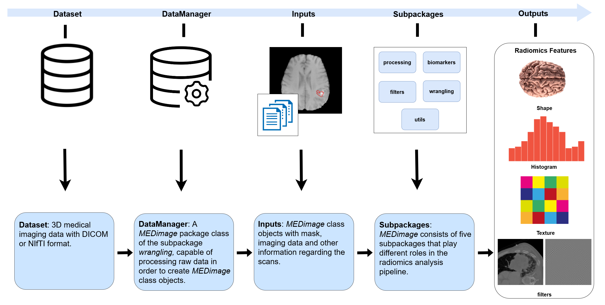

## État

En cours (2022 Avril-aujourd'hui)

## Type

Général

## Équipe

- [Mahdi Ait Lhaj Loutfi]()1 (2021-aujourd'hui)
- [Clarisse Cheng]()1 (été 2022)
- [Corentin Gauthier]()1 (été 2022)
- [Martin Vallières]()1 (2020-aujourd'hui)
- [Mohammed Benabbassi]()1 (automne 2022)

1 Départment d'informatique, Université de Sherbrooke, Sherbrooke (QC), Canada

## Description

[MEDimage](https://github.com/MahdiAll99/MEDimage) est un logiciel _open-source_ de traitements des images médicales et de calculs radiomiques. Il a été créé par notre laboratoire en collaboration avec le consortium international de scientifiques médicaux (<https://medomics.ai>). Le logiciel est basé sur le langage de programmation Python et construit avec différentes couches de flexibilité via des modules, des classes et des paramètres d'otpion qui permettent de charger, traiter, des images médicales et en calculer des caractéristiques radiomques. Le flux de travail intrinsèque de MEDimage est conçu pour être adéquat à ces tâches et dispose aussi d'une [documentation](https://medimage.readthedocs.io/en/latest/) riche en tutoriels, démonstrations et instructions qui sont en mesure de bien initier les utilisateurs novices au logiciel. Avec ce logiciel, nous souhaitons fournir une plateforme open-source testée, maintenue et standardisé avec les normes internationaux définies par l'[IBSI](https://theibsi.github.io/) pour un traitement d'image et une extraction des radiomiques faciles et reproductibles.

Voici un vidéo réalisé par notre stagiaire [Corentin Gauthier]() qui présente
ce qu'il a réalisé lors de son stage ainsi que le projet MEDimage.

<iframe width="560" height="315" src="https://www.youtube.com/embed/ODJ3TD5H11Q" title="YouTube video player" frameborder="0" allow="accelerometer; autoplay; clipboard-write; encrypted-media; gyroscope; picture-in-picture" allowfullscreen></iframe>

Ce logiciel est développée en collaboration avec : 

- [University California San Francisco](https://www.ucsf.edu/) (Olivier Morin, Taman Upadhaya, Jorge Barrios)

