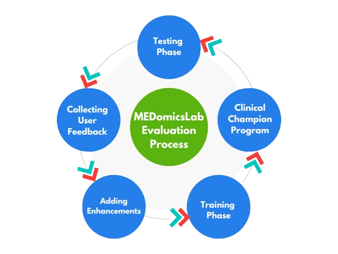

## État

En cours (2024-aujourd'hui)

## Type

Maîtrise

## Équipe

- [Mariem Kallel]()1 (2024-aujourd'hui)
- [Martin Vallières]()1 (2024-aujourd'hui)

1 Départment d'informatique, Université de Sherbrooke, Sherbrooke (QC), Canada

MEDomicsLab est une plateforme d’intelligence artificielle conçue pour aider les cliniciens dans l’analyse et l’interprétation des données médicales. Bien que son potentiel en tant qu’outil d’aide à la décision soit important, son adoption dépend fortement de son ergonomie et de sa facilité d’utilisation dans un cadre clinique. Ce projet de recherche vise à optimiser l’expérience utilisateur de la plateforme en se concentrant sur trois axes clés :

### 1. Redesign du Learning Module de MEDomicsLab :

Ce module est un outil central permettant aux utilisateurs d’entraîner et d’évaluer des modèles de Machine Learning sur des bases de données médicales. Cependant, son design actuel présente certaines limites en termes d’accessibilité. Ce projet vise à élargir ses fonctionnalités en ajoutant davantage d’options d’entraînement, en améliorant sa flexibilité et en optimisant les workflows pour prendre en charge différentes stratégies de machine learning. Ces améliorations permettront d’adapter l'entraînement des modèles à divers scénarios cliniques tout en assurant une utilisation intuitive pour des cliniciens ayant des niveaux de compétence technique variés.

### 2. Améliorations UX/UI :

Au-delà du module d’apprentissage, l’interface globale de MEDomicsLab nécessite des améliorations afin de mieux répondre aux besoins et attentes des cliniciens. L’objectif est d’optimiser les workflows, d’améliorer la clarté des éléments visuels et de garantir une interaction fluide et efficace avec la plateforme.

### 3. Validation des Preuves de Concept :

Pour favoriser l’adoption de MEDomicsLab, il est essentiel de valider ses fonctionnalités à travers des cas d’usage concrets et des évaluations de performance. Cela implique de tester les modèles de Machine Learning de la plateforme sur des ensembles de données cliniques réels et d’évaluer leur utilisabilité. Ces validations seront réalisées à l’aide de bases de données comme MIMIC et eICU, ainsi qu’en répliquant l’étude HAIM (Holistic AI in Medicine). Des tests end-to-end seront également effectués à l’aide des frameworks MedFL et med3pa, garantissant ainsi l’efficacité de la plateforme dans un contexte clinique réel.

## Objectif final : 
L’objectif ultime de cette recherche est de publier un article scientifique présentant MEDomicsLab en tant que plateforme et son potentiel d’intégration dans les flux de travail hospitaliers. En répondant aux défis d’utilisabilité clés, ce travail vise à combler le fossé entre les outils de santé basés sur l’IA et leur adoption effective en milieu clinique, faisant de MEDomicsLab une solution plus accessible et adaptée aux besoins des professionnels de santé.
