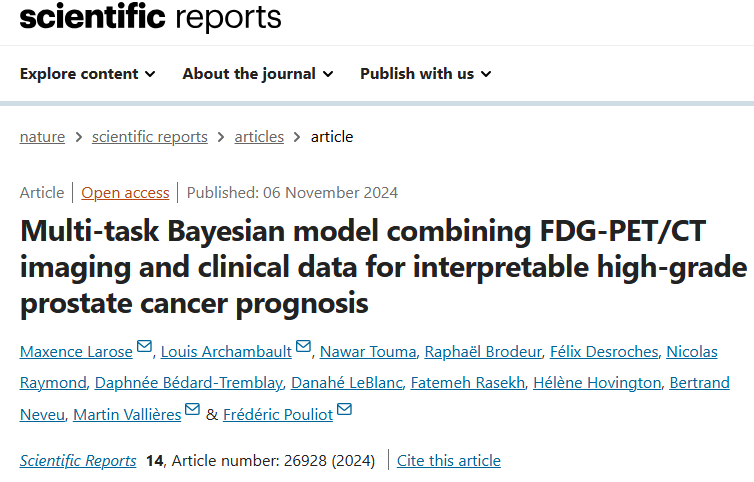

## Date

2024-11-06

## Auteurs

  - [Maxence Larose]()1
  - Louis Archambault1,2
  - Nawar Touma2
  - Raphael Brodeur1,2
  - Félix Desroches1,2
  - [Nicolas Raymond]()3
  - Daphnée Bédard-Tremblay2
  - Danahé LeBlanc1,2
  - Fatemeh Rasekh2
  - Hélène Hovington2
  - Bertrand Neveu2
  - [Martin Vallières]()3
  - Frédéric Pouliot2

1 Département de physique, de génie physique et d’optique, et Centre de recherche sur le cancer, Université Laval, Québec (QC), Canada.

2 CHU de Québec – Université Laval et CRCHU de Québec, Québec (QC), Canada.

3 Department of Computer Science, Université de Sherbrooke, Sherbrooke (QC), Canada.

## Résumé

We propose a fully automatic multi-task Bayesian model, named Bayesian Sequential Network (BSN), for predicting high-grade (Gleason 8) prostate cancer (PCa) prognosis using pre-prostatectomy FDG-PET/CT images and clinical data. BSN performs one classification task and five survival tasks: predicting lymph node invasion (LNI), biochemical recurrence-free survival (BCR-FS), metastasis-free survival, definitive androgen deprivation therapy-free survival, castration-resistant PCa-free survival, and PCa-specific survival (PCSS). Experiments are conducted using a dataset of 295 patients. BSN outperforms widely used nomograms on all tasks except PCSS, leveraging multi-task learning and imaging data. BSN also provides automated prostate segmentation, uncertainty quantification, personalized feature-based explanations, and introduces dynamic predictions, a novel approach that relies on short-term outcomes to refine long-term prognosis. Overall, BSN shows great promise in its ability to exploit imaging and clinicopathological data to predict poor outcome patients that need treatment intensification with loco-regional or systemic adjuvant therapy for high-risk PCa.

## Liens

  - [Page de l'article](https://www.nature.com/articles/s41598-024-77498-0)
  - [Article en version PDF](https://www.nature.com/articles/s41598-024-77498-0.pdf)
