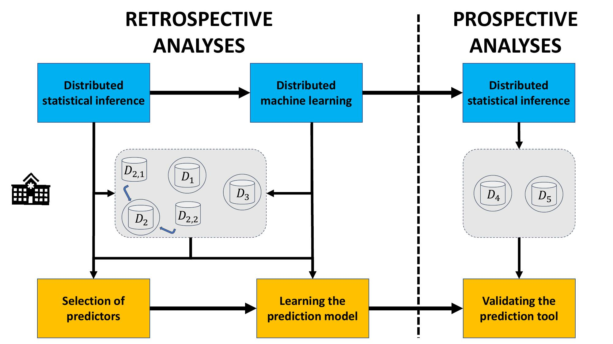

## État

En cours (2020-aujourd'hui)

## Type

Général

## Équipe

- [Fabio Provencher-Flores]()1 (été 2020)
- [François Marcoux]()1 (été 2020)
- [Julien Corriveau-Trudel]()1 (été 2020)
- [Nicolas Raymond]()1 (2020-aujourd'hui)
- [Olivier Lefebvre]()1 (2020-aujourd'hui)
- [Martin Vallières]()1 (2020-aujourd'hui)

1 Départment d'informatique, Université de Sherbrooke, Sherbrooke (QC), Canada

## Description

L'objectif de ce projet est de rédiger un rapport pour mettre en place les méthodes associées à la Figure 1 ci-dessous.

- [Document en cours de rédaction : « _Distributed Statistical Inference and Learning in Health: An Introduction_ » ](https://www.dropbox.com/s/sqlmgr330e1v4mu/DL_Report_in_progress.pdf?dl=0)

Ce projet est effectué en collaboration avec :
- [Félix Camirand-Lemyre](https://griis.ca/a-propos/equipe/felix-camirand-lemyre/)
- [Jean-François Ethier](https://griis.ca/a-propos/equipe/jean-francois-ethier-codirecteur-scientifique/)
