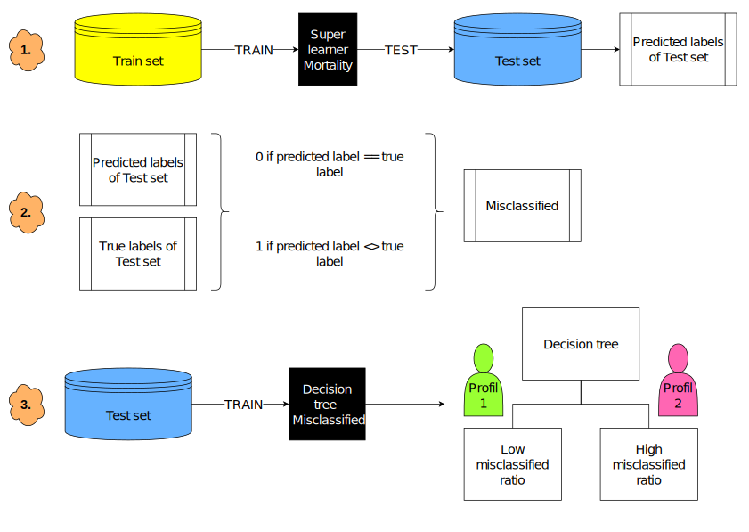
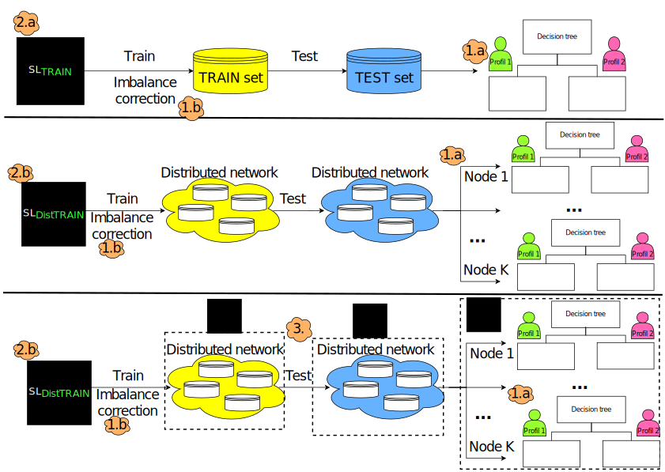

## Status

In progress (2021-today)

## Type

Doctorate

## Team

- [Olivier Lefebvre]()1 (2021-today)
- [Félix Camirand Lemyre](https://www.usherbrooke.ca/mathematiques/nous-joindre/personnel/corps-professoral/professeurs/felix-camirand-lemyre)2 (2021-today)
- [Jean-François Éthier](https://www.usherbrooke.ca/recherche/specialistes/details/jean-francois.ethier)3 (2021-today)
- [Martin Vallières]()1 (2021-today)

1 Computer science department, Université de Sherbrooke, Sherbrooke (QC), Canada

2 Mathematics department, Université de Sherbrooke, Sherbrooke (QC), Canada

3 Medicine department, Université de Sherbrooke, Sherbrooke (QC), Canada

## Description
Artificial intelligence in the medical field can greatly contribute to improving health care. However, conventional, so-called centralized machine learning has several limitations, mainly due to the limited amount of data available for research. A trivial option would be to aggregate all data from multiple medical centers into a single center (a single centralized database). However, it is difficult or impossible to centralize this information due to the confidential nature of medical data as well as the regulations surrounding this field. Therefore, we need to develop so-called Distributed Learning models with federated datasets (distributed in various nodes, semantically and structurally comparable). In order to guarantee a level of confidentiality on the data, we must also consider confidentiality measures in our models. We thus apply the concepts of Differential Privacy. Distributed learning and differential privacy generally lead to some loss of performance for predictions. We will therefore try to reduce these performance losses with an assembly model combining several learning models, and called the "Super Learner". Furthermore, we will develop a method to evaluate the uncertainty of our model for each prediction made. This will allow us to avoid inferring a result when the model shows too much uncertainty. In order to evaluate the performance gains obtained by these methods, we will focus on the prediction of mortality after admission to the Intensive Care Unit. The prediction of mortality in the ICU is crucial for a good treatment of patients. The goal of this project is to develop a distributed Super Learner with differential privacy to predict mortality after admission to the ICU.

## Objectives

  1. Investigation of model prediction uncertainty
  2. Development of a federated ensemble learning model (distributed superlearner)
  3. Adding differential privacy to learning models

  
  
