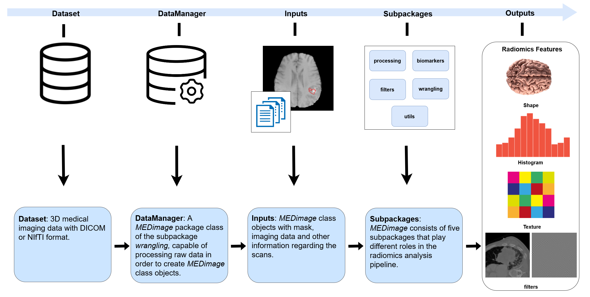

## Status

In progress (2022 April-today)

## Type

General

## Team

- [Clarisse Cheng]()1 (summer 2022)
- [Corentin Gauthier]()1 (summer 2022)
- [Mahdi Ait Lhaj Loutfi]()1 (2021-today)
- [Martin Vallières]()1 (2020-today)
- [Mohammed Benabbassi]()1 (fall 2022)

1 Computer science department, Université de Sherbrooke, Sherbrooke (QC), Canada

## Description

[MEDimage](https://github.com/MahdiAll99/MEDimage) is an _open-source_ software for medical image processing and radiomic calculations. It was created by our laboratory in collaboration with the international consortium of medical scientists (<https://medomics.ai>). The software is based on the Python programming language and built with different layers of flexibility via modules, classes and parameters otpion that allow to load, process, medical images and calculate radiomic features from them. The intrinsic workflow of MEDimage is designed to be adequate to these tasks and offers a [documentation](https://medimage.readthedocs.io/en/latest/) rich in tutorials, demonstrations and instructions that are able to introduce novice users to the software. With this software, we aim to provide an open-source platform tested, maintained and standardized with the international norms defined by the [IBSI](https://theibsi.github.io/) for easy and reproducible image processing and radiomics extraction.

  Here is a video made by our intern [Corentin Gauthier]() 
  which presents what he realized during his internship as well as the MEDimage project.

<iframe width="560" height="315" src="https://www.youtube.com/embed/ODJ3TD5H11Q" title="YouTube video player" frameborder="0" allow="accelerometer; autoplay; clipboard-write; encrypted-media; gyroscope; picture-in-picture" allowfullscreen></iframe>

This platform is being developed in collaboration with: 
- [University California San Francisco](https://www.ucsf.edu/) (Olivier Morin, Taman Upadhaya, Jorge Barrios)
