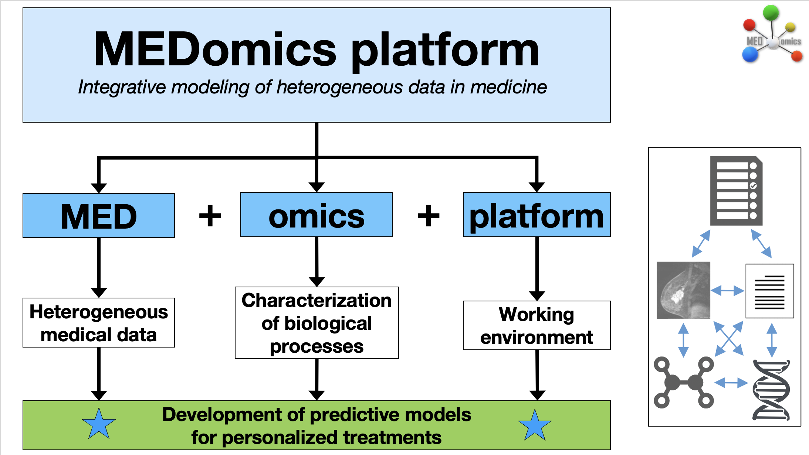
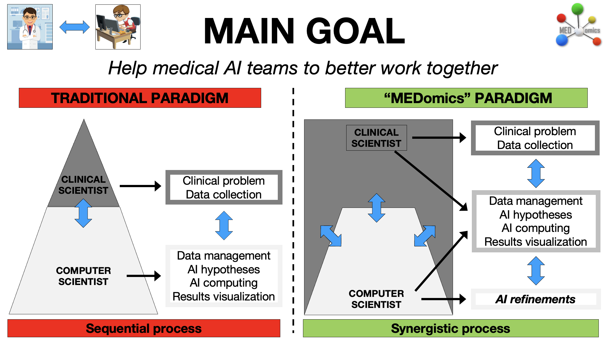
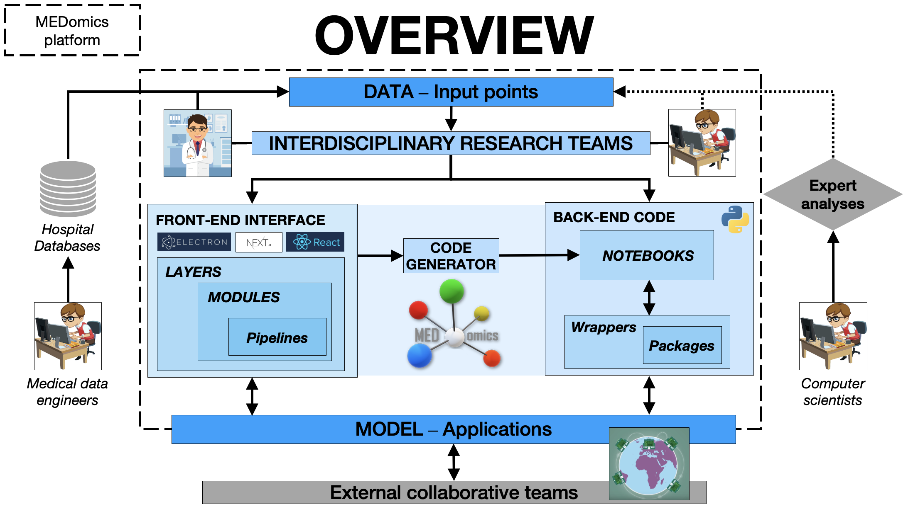
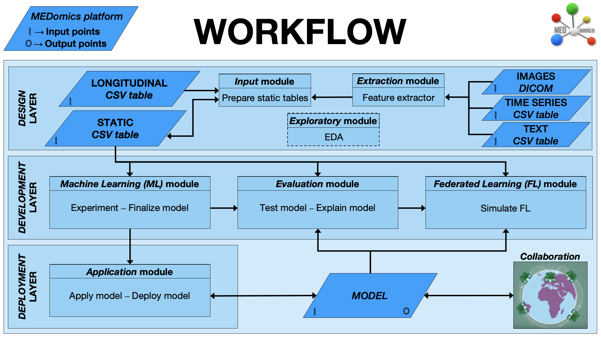

## Status

In progress (2020-today)

## Type

General

## Team

- [Andréanne Allaire]()1 (2022-2024)
- [Brahim Fakri]()1 (2022-2025)
- [Cedrik Lampron]()1 (2024-2025)
- [Charles Lévesque-Matte]()1 (fall 2020)
- [Charles-Olivier Ipperciel]()1 (2024-2025)
- [Clarisse Cheng]()1 (summer 2022)
- [Corentin Gauthier]()1 (summer 2022)
- [Guillaume Blain]()1 (summer 2022-2025)
- [Hithem Lamri]()1 (fall 2022-2023)
- [Jonathan Perron]()1 (2020-2021)
- [Kayla Davio-Roy]()1 (summer 2021)
- [Ludmila Amriou]()1 (2023-2024)
- [Lyna Hiba Chikouche]()1 (2023-2024)
- [Mahdi Ait Lhaj Loutfi]()1 (2021-today)
- [Mamadou Mountagha Bah]()1 (2020-2021)
- [Mariem Kallel]()1 (2024-today)
- [Mohammed Benabbassi]()1 (fall 2022)
- [Nicolas Longchamps]()1 (summer 2022-today)
- [Ouael Nedjem Eddine SAHBI]()1 (2023-today)
- [Robin Mailhot]()1 (fall 2020)
- [Sarah Denis]()1 (2023-2024)
- [Martin Vallières]()1 (2020-today)

1 Department of Computer Science, Université de Sherbrooke, Sherbrooke (QC), Canada

## Description

[//]: # (MEDomics platform is an _open-source_ computing platform for integrative data modeling in medicine. It was created by an )

[//]: # (international consortium of medical scientists &#40;<https://medomics.ai>&#41;, whose main goal is to facilitate the )

[//]: # (development and clinical translation of artificial intelligence &#40;AI&#41; applications in medicine. The platform is based )

[//]: # (on the Python programming language and contains five major modules that allow loading, processing, exploring )

[//]: # (multi-omics data, and creating and evaluating actionable models for precision medicine. MEDomics platform's intrinsic )

[//]: # (workflow is designed to provide different levels of abstraction of methodological complexity to users and developers )

[//]: # (via application scripts, option parameters and class structures. In general, MEDomics platform is envisioned to be at the )

[//]: # (center of multidisciplinary research teams and hospital database infrastructures.)

[//]: # ()
[//]: # (Recent advances in so-called "omics" technologies &#40;genomics, radiomics, proteomics, etc.&#41; offer unprecedented )

[//]: # (opportunities to characterize biological processes that are related to certain phenotypes. The effective combination )

[//]: # (of these elements as "multi-omics modeling" will certainly allow us to better tailor treatments to individual )

[//]: # (patients &#40;i.e., "precision medicine"&#41;.)

[//]: # ()
[//]: # (Given the complexity of medical problems, achieving the full potential of precision medicine is directly related )

[//]: # (to our ability to properly manage, structure and leverage our hospital databases. Therefore, mastering and combining )

[//]: # (the following data analysis techniques should increase the impact of the "multi-omics" prediction models that are )

[//]: # (built from these databases:)

[//]: # ()
[//]: # (1. _Image analysis_: extraction of radiomic features allows us to better characterize tumor heterogeneity. The [MEDimage]&#40;&#41; package is the dedicated component for this task.)

[//]: # (2. _Machine learning_: some learning techniques allow us to better combine data from different categories &#40;such as multi-omics&#41;.)

[//]: # (3. _Deep learning_: the multitude of deep neural network architectures offers several possibilities for the automatic learning of different tasks in medicine. The performance of some networks is sometimes superior to that of humans.)

[//]: # (4. _Automatic text processing_: automatic processing and coding of textual reports from electronic patient records would allow for better integration of information relevant to multi-omics modeling throughout the patient management period.)

[//]: # (5. _Federated learning_: in order to increase the amount of modeled data from different health care institutions, a distributed learning approach can be used - data is kept within the boundaries of each institution, thus avoiding data transfer and privacy issues.)

For more information, see the [project website](https://medomics-udes.gitbook.io/medomics-docs/quick-start).

[//]: # (This platform is being developed in collaboration with: )

[//]: # (- [University California San Francisco]&#40;https://www.ucsf.edu/&#41; &#40;Olivier Morin, Taman Upadhaya, Jorge Barrios&#41;)

[//]: # (- [University of Toronto]&#40;https://www.utoronto.ca/&#41; &#40;Jan Seuntjens&#41;)

[//]: # (- [The D-Lab]&#40;https://precisionmedicinemaastricht.eu/the-d-lab/&#41; &#40;Philippe Lambin, Henry Woodruff, Avishek Chatterjee&#41;)

[//]: # (- [Oncoray]&#40;https://www.oncoray.de/&#41; &#40;Alex Zwanenburg, Steffen Löck&#41;)

[//]: # (- [Université Laval]&#40;https://www.ulaval.ca/&#41; &#40;Louis Archambault, Philippe Després&#41; )
