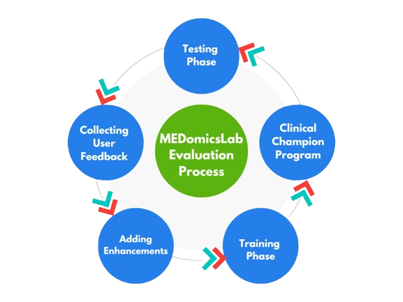

## Status

In progress (2024-today)

## Type

Master's

## Team

- [Mariem Kallel]()1 (2024-today)
- [Martin Vallières]()1 (2024-today)

1 Computer science department, Université de Sherbrooke, Sherbrooke (QC), Canada

MEDomics platform is an AI-driven platform designed to assist clinicians in analyzing and interpreting medical data. While its potential for supporting decision-making is significant, its usability remains a critical factor in ensuring its effective adoption in clinical practice. This research project aims to optimize the platform’s user experience by focusing on three key areas:

### 1. Redesigning the Learning Module in MEDomics platform :

The Learning Module is a central tool that allows users to train and evaluate Machine Learning models on medical datasets. However, its current design presents usability challenges that may hinder accessibility. This project involves expanding its functionalities by adding more training options, improving flexibility, and optimizing workflows to accommodate different machine learning strategies. These enhancements aim to make model training more adaptable to diverse clinical scenarios while maintaining ease of use for clinicians with varying technical expertise.

### 2. UX/UI Improvements for Better Accessibility

Beyond the Learning Module, MEDomics platform’s overall interface requires enhancements to better align with the needs and expectations of clinicians. The goal is to streamline workflows, improve the clarity of visual elements, and ensure that interactions with the platform feel natural and efficient. 

### 3. Proof-of-Concept Validation

To support the adoption of MEDomics platform, it is crucial to validate its functionalities through concrete use cases and performance evaluations. This involves testing the platform’s Machine Learning models on real-world clinical datasets and assessing their usability. The results will serve as evidence of the platform’s reliability and effectiveness in clinical settings.

## Final Objective

The ultimate goal of this research is to publish a scientific article that presents MEDomics platform as a software and its potential for integration into clinical workflows. By addressing key usability challenges, this work aims to bridge the gap between AI-driven healthcare tools and real-world clinical adoption, making MEDomics platform a more accessible and practical solution for healthcare professionals.
