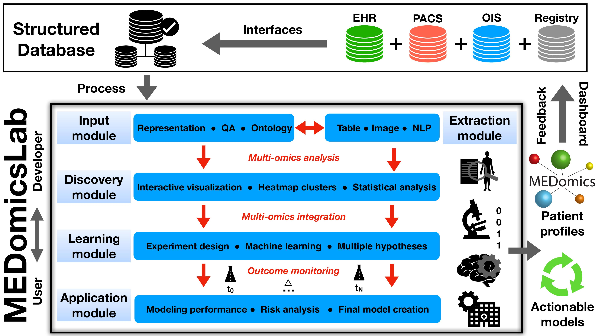

## Status

In progress (2020-today)

## Type

General

## Team

- [Charles Lévesque-Matte]()1 (fall 2020)
- [Clarisse Cheng]()1 (summer 2022)
- [Corentin Gauthier]()1 (summer 2022)
- [Guillaume Blain]()1 (summer 2022-today)
- [Jonathan Perron]()1 (2020-2021)
- [Kayla Davio-Roy]()1 (summer 2021)
- [Mahdi Ait Lhaj Loutfi]()1 (2021-today)
- [Mamadou Mountagha Bah]()1 (2020-2021)
- [Mohammed Benabbassi]()1 (fall 2022-today)
- [Nicolas Longchamps]()1 (summer 2022-today)
- [Robin Mailhot]()1 (fall 2020)
- [Martin Vallières]()1 (2020-today)

1 Computer science department, Université de Sherbrooke, Sherbrooke (QC), Canada

## Description

MEDomicsLab is an _open-source_ computing platform for integrative data modeling in oncology. It was created by an 
international consortium of medical scientists (<https://medomics.ai>), whose main goal is to facilitate the 
development and clinical translation of artificial intelligence (AI) applications in medicine. The platform is based 
on the Python programming language and contains five major modules that allow loading, processing, exploring 
multi-omics data, and creating and evaluating actionable models for precision oncology. MEDomicsLab's intrinsic 
workflow is designed to provide different levels of abstraction of methodological complexity to users and developers 
via application scripts, option parameters and class structures. In general, MEDomicsLab is envisioned to be at the 
center of multidisciplinary research teams and hospital database infrastructures.

Recent advances in so-called "omics" technologies (genomics, radiomics, proteomics, etc.) offer unprecedented 
opportunities to characterize biological processes that are related to cancer phenotypes. The effective combination 
of these elements as "multi-omics modeling" will certainly allow us to better tailor treatments to individual 
patients (i.e., "precision oncology").

Given the complexity of the cancer problem, achieving the full potential of precision oncology is directly related 
to our ability to properly manage, structure and leverage our hospital databases. Therefore, mastering and combining 
the following data analysis techniques should increase the impact of the "multi-omics" prediction models that are 
built from these databases:

1. _Image analysis_: extraction of radiomic features allows us to better characterize tumor heterogeneity. The [MEDimage]() package is the dedicated component for this task.
2. _Machine learning_: some learning techniques allow us to better combine data from different categories (such as multi-omics).
3. _Deep learning_: the multitude of deep neural network architectures offers several possibilities for the automatic learning of different tasks in oncology. The performance of some networks is sometimes superior to that of humans.
4. _Automatic text processing_: automatic processing and coding of textual reports from electronic patient records would allow for better integration of information relevant to multi-omics modeling throughout the patient management period.
5. _Federated learning_: in order to increase the amount of modeled data from different health care institutions, a distributed learning approach can be used - data is kept within the boundaries of each institution, thus avoiding data transfer and privacy issues.

This platform is being developed in collaboration with: 
- [University California San Francisco](https://www.ucsf.edu/) (Olivier Morin, Taman Upadhaya, Jorge Barrios)
- [University of Toronto](https://www.utoronto.ca/) (Jan Seuntjens)
- [The D-Lab](https://precisionmedicinemaastricht.eu/the-d-lab/) (Philippe Lambin, Henry Woodruff, Avishek Chatterjee)
- [Oncoray](https://www.oncoray.de/) (Alex Zwanenburg, Steffen Löck)
- [Université Laval](https://www.ulaval.ca/) (Louis Archambault, Philippe Després) 
