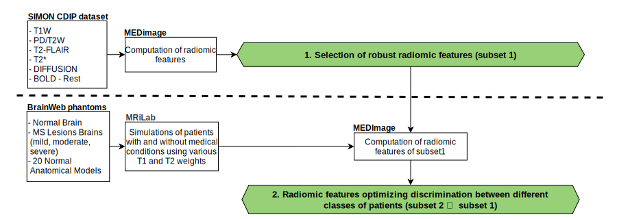

## Status

In progress (2021-today)

## Type

Master's

## Team

- [Andréanne Allaire]()1 (2021-today)
- [Philippe Després](https://iid.ulaval.ca/equipes/philippe-despres/)2 (2021-today)
- [Martin Vallières]()1 (2021-today)

1 Computer science department, Université de Sherbrooke, Sherbrooke (QC), Canada

2 Physics, physics engineering and optics department, Université Laval, Québec (QC), Canada

## Description

In medical imaging, radiomic features make it possible to obtain measurements in addition to clinical and genomic ones for a region of interest in a medical image. These radiomics can be used in decision support in a context of precision medicine. The motivation of this project is that the determination of the reliable radiomics having the best predictive potential would make it possible to improve precision medicine based on the analysis of MRI images. To do this, two assumptions are made at the base of this project. The first being that the study of radiomics of intercenter MRI images with a single protocol for the same patient would make it possible to determine a subgroup of robust radiomics. The second is that the calculation of robust radiomics for simulated images of patients with and without medical condition using various T1 and T2 weights would allow to determine a subgroup of radiomics which could be used in order to optimize the discrimination between the different categories of patients (with and without medical condition).

To verify hypotheses with the aim of determining a subset of reliable radiomics with the best predictive ability, a project methodology plan was developed (see figure above). This plan is subdivided into two distinct parts. First, an analysis pipeline of real medical images will be set up in order to quantify the robustness of the radiomic characteristics. The images used will be those from the SIMON database ([Single Individual volunteer for Multiple Observation across Networks](http://fcon_1000.projects.nitrc.org/indi/retro/SIMON.html)). Then, an MRI acquisition simulation pipeline will be developed to assess the potential for optimizing radiomic features in magnetic resonance imaging. The phantoms used for the simulations will be those of [BrainWeb](https://brainweb.bic.mni.mcgill.ca/); the simulator used is that of [MRiLab](https://doi.org/10.1109/TMI.2016.2620961). The calculations of the radiomics carried out during the project will be done using the platform [MEDimage](https://github.com/MahdiAll99/MEDimage).
