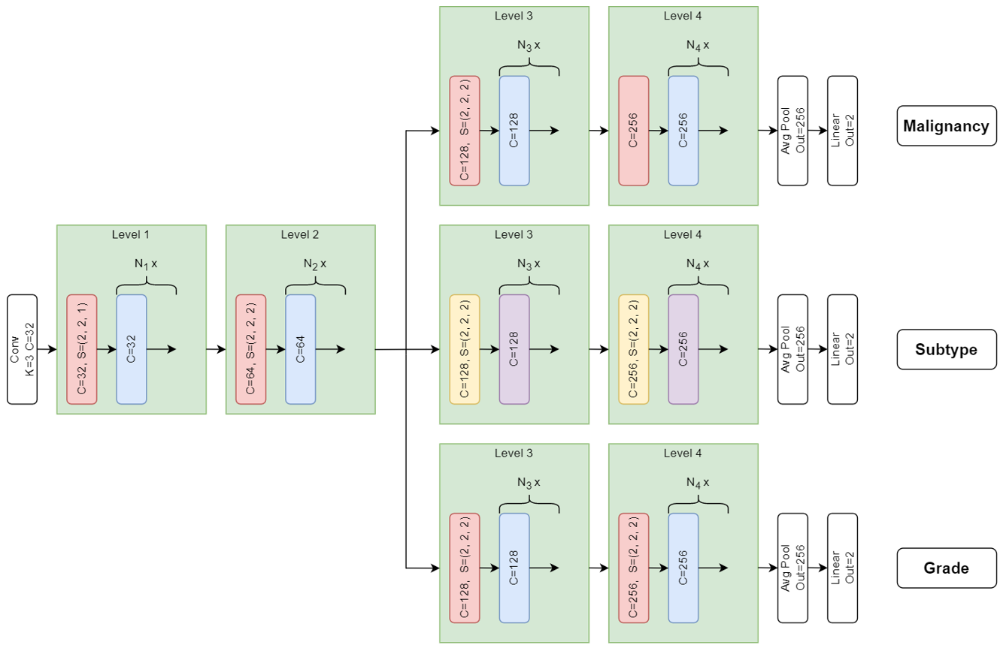

## Status

In progress (2020-today)

## Type

Master's

## Team

- [Alexandre Ayotte]()1 (2020-today)
- [Martin Vallières]()1 (2020-today)

1 Computer science department, Université de Sherbrooke, Sherbrooke (QC), Canada

## Data

For this project, data from 1,082 patients from 5 institutions with clinical data such as age, sex and tumor size, 
as well as 3D MRI images (T1, T2) with the region of interest of the tumors are used.

## Classification

From the previously stated data, the goal is to develop a multi-task model to perform three binary classification 
tasks, which are: 
- Malignancy classification (399 benign, 683 malignant)
- Subtype classification (only for malignant tumors) (158 papillary, 441 clear cell)
- Grade classification (only for malignant tumors) (391 low grade, 202 high grade)

## Objectives

- Develop an integrated decision support system for the three classification tasks
- Evaluate the effectiveness of multi-task learning in the context of medical imaging and tumor classification
- Establish the benefit of radiomics as an auxiliary task in the context of multi-task learning
