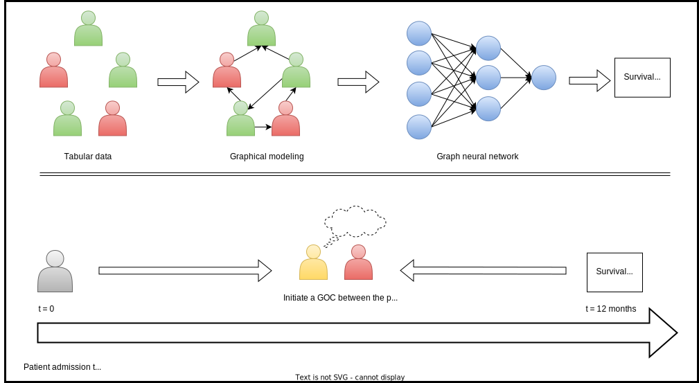

## Status

Completed (2022)

## Type

Doctorate

## Team

- [Hakima Laribi]()1 (2022-today)
- [Martin Vallières]()1 (2022-today)

1 Computer science department, Université de Sherbrooke, Sherbrooke (QC), Canada

## Description

A goal of care discussion GOC is a communication process that takes place in a hospital setting between a clinician and a patient at the end of life. The purpose of a GOC discussion is to determine the types of care to be administered to the patient so as not to result in more aggressive cares than desired. Nevertheless, the prognoses established by doctors only gaining certainty over time constitute the main constraint delaying the initiation of a GOC discussion. Therefore, the automatic identification of the patients at the end of life when admitted to the hospital would increase the chances to carry out a GOC discussion on time. In this sense, a model based on random forests [[R. Taseen, 2021](https://www.researchgate.net/publication/354327628_Expected_clinical_utility_of_automatable_prediction_models_for_improving_palliative_and_end-of-life_care_outcomes_Toward_routine_decision_analysis_before_implementation)] which attempts to predict patient mortality in the year following their admission to hospital has already been developed. Although the trees constituting the random forests expose relevant informations about the importance of each predictor, no relationship between the patients can be learned. Consequently, we propose a solution based on graphical neural networks for the prediction of patient mortality in the year following their hospital admission. Thus, the predictions at patient level will be made according to all the neighboring and the results obtained can be explained by consulting the connections of the patient. This graph-based approach would infer relationships between patients and thus add interpretability and performance to a model based on random forests.

**Objectives:** 

- Model data graphically to learn connections between patients.
- Develop a prediction method based on graphical neural networks to identify patients with a high risk of mortality.

**Expected results:**

- Improve the precision and accuracy of prediction with a solution based on graphical neural networks.
- A post analysis and interpretation of the results.

[Link to the final-year project thesis.](https://drive.google.com/file/d/1V07KJhqhuX_QNnorJ6pKtT83dpRiq2qz/view?usp=share_link)

[Link to the defense presentation.](https://drive.google.com/file/d/1OVMOlbU7Df9fkjsuBtZW7mfl0lQwFfl_/view?usp=share_link)
