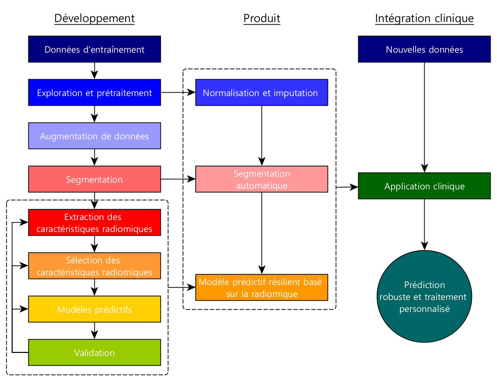
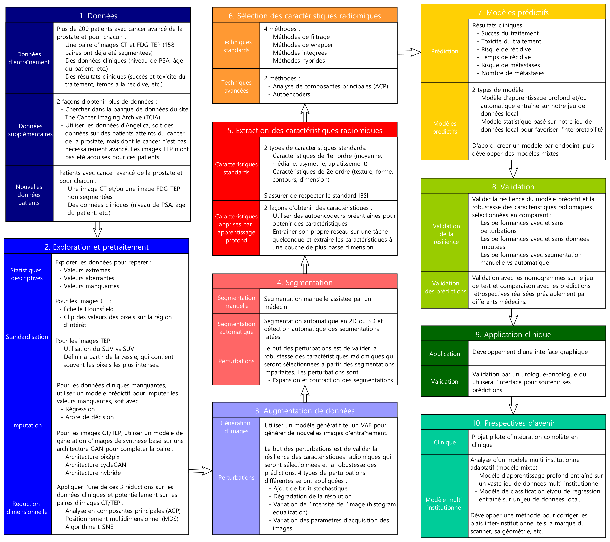

## État

En cours (2021-aujourd'hui)

## Type

Maîtrise

## Équipe

- [Maxence Larose]()1,2,3
- [Louis Archambault](https://www.crchudequebec.ulaval.ca/recherche/chercheurs/louis-archambault/)1,2
- [Martin Vallières]()3

1 Département de physique, génie physique et optique, Université Laval, Québec (QC), Canada

2 CHU de Québec, Québec (QC), Canada

3 Départment d'informatique, Université de Sherbrooke, Sherbrooke (QC), Canada

## But du projet

**Objectif** : Développer des modèles prédictifs résilients basés sur l'imagerie quantitative et les caractéristiques 
cliniques pour guider le traitement contre le cancer avancé de la prostate en utilisant des images de différentes 
modalités telles la tomodensitométrie (TDM) et la tomographie par émission de positrons (TEP).

**3 objectifs spécifiques :** 

- La génération de données synthétiques pour imputer les données manquantes.
- La segmentation automatique des organes d'intérêt et la détection des segmentations ratées.
- La prédiction robuste de résultats cliniques qui sera basée sur des caractéristiques radiomiques stables.
