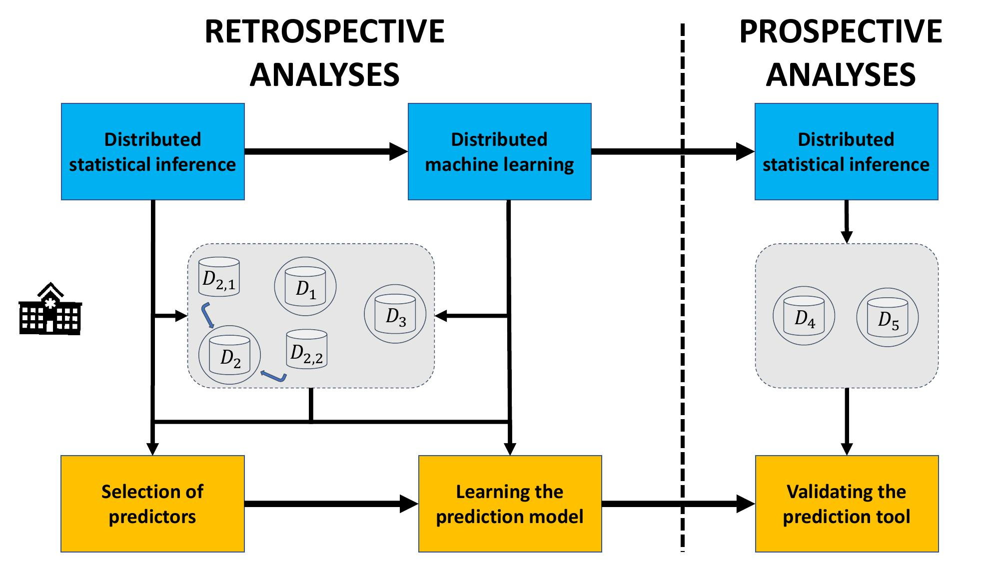

## Status

Done (2020-)

## Type

General

## Team

- [Fabio Provencher-Flores]()1 (summer 2020)
- [François Marcoux]()1 (summer 2020)
- [Julien Corriveau-Trudel]()1 (summer 2020)
- [Nicolas Raymond]()1 (2020-)
- [Olivier Lefebvre]()1 (2020-)
- [Martin Vallières]()1 (2020-)

1 Computer science department, Université de Sherbrooke, Sherbrooke (QC), Canada

## Description

The objective of this project is to write a report to implement the methods associated with the figure below.

- [Document in progress: « _Distributed Statistical Inference and Learning in Health: An Introduction_ » ](https://www.dropbox.com/s/sqlmgr330e1v4mu/DL_Report_in_progress.pdf?dl=0)

This project is being conducted in collaboration with:
- [Félix Camirand-Lemyre](https://griis.ca/a-propos/equipe/felix-camirand-lemyre/)
- [Jean-François Ethier](https://griis.ca/a-propos/equipe/jean-francois-ethier-codirecteur-scientifique/)
