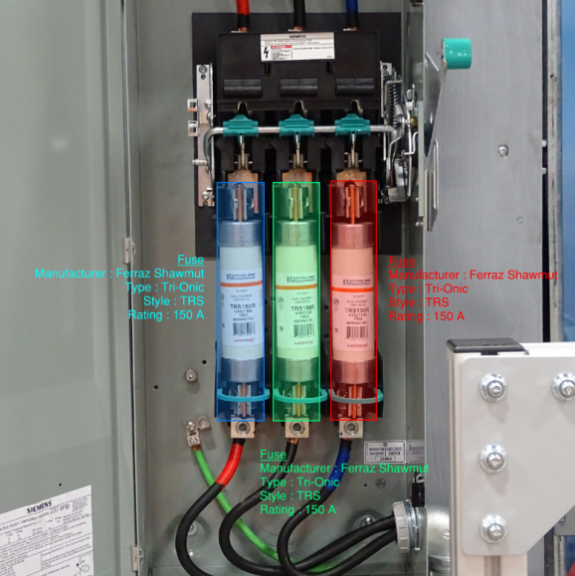

## Status

Completed (2020-2022)

## Type

Master's

## Équipe

- [Simon Giard-Leroux]()1 (2020-2022)
- [Guillaume Cléroux]()1 (été 2021 et hiver 2022)
- [Alex Chorel-Campanozzi]()1 (été 2021)
- [Achille Lanctôt-Saumure]()1 (automne 2021)
- [Shreyas Sunil Kulkarni]()2 (2020-2021)
- [François Bouffard](https://www.mcgill.ca/ece/francois-bouffard)3 (2020-2022)
- [Martin Vallières]()1 (2020-2022)

1 Computer science department, Université de Sherbrooke, Sherbrooke (QC), Canada

2 Birla Institute of Technology and Science, Pilani, Inde

3 Electrical and computer engineering department, McGill University, Montreal (QC), Canada

## Note

This project is not related to the field of medical informatics, but it involves object detection principles that will 
be applied to medical imaging in the future.

## Objective

Conventional electrical engineering still relies on working methods based on manual analysis of photos and drawings, 
which can be slow and prone to human error. We want to apply new artificial intelligence (AI) and machine learning 
technologies to the field of classical electrical engineering to facilitate the interpretation of drawings and 
photos of electrical equipment. Subsequently, the interpretation of this information would allow the construction 
of computational models to accelerate the manual work required to perform short-circuit and arc studies, while 
reducing the risk of human error.

The first objective of this project will be to detect the type of electrical fuses in photos taken by electrical 
engineers during site surveys in places such as industrial buildings. To this end, photos of electrical fuses 
collected during previous projects conducted by the engineering firm CIMA+ and photos from the Web (Google Images) 
will be used to train object detection algorithms. The second objective of this project will be to detect equipment 
symbols on electrical drawings, detect the descriptive text linked to each symbol, detect the links between symbols 
and automate the creation of models that can be imported into a calculation software.

This automation will provide greater accuracy and reduce the time required to interpret electrical installation 
surveys, thereby increasing the efficiency of the electrical engineer's work and the safety of the public regarding 
electrical installations.
