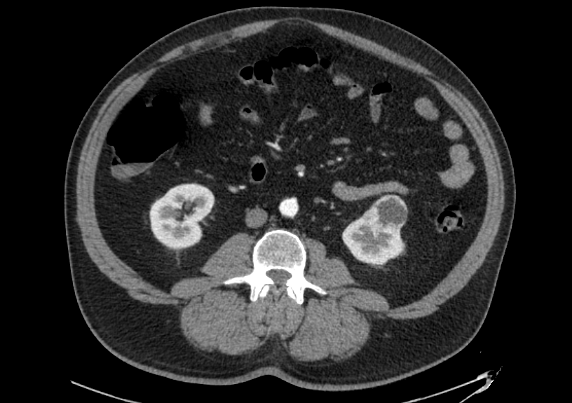

## Status

Completed  (2022-2024)

## Type

Master's

## Team

- [Teodora Boblea Podasca]()1 (2022-today)
- [Dr. Patrick Richard](https://www.usherbrooke.ca/recherche/specialistes/details/patrick.richard)1 (2022-today)
- [Martin Vallières]()2 (2022-today)

1 Surgery department, Urology service, Université de Sherbrooke, Sherbrooke (QC), Canada

2 Computer science department, Université de Sherbrooke, Sherbrooke (QC), Canada

## Description

Despite advances in medical imaging over the past few decades, it cannot accurately determine whether a small (<4 cm) 
renal mass is benign or malignant. This makes it difficult for urologists to select patients who would benefit from a 
conservative approach (active surveillance) rather than invasive treatment. Currently, the treatments available are: 
(1) surgery and (2) thermoablation. Despite their effectiveness, these are invasive treatments that could be avoided 
in some patients. 

The objective of this project is to establish a model that will reliably predict whether a small renal mass is benign 
or malignant. In order to achieve this goal, we will combine radiomics (on CT scans) and some clinical data such as 
sex and age.  

Ultimately, we hope that this project will help physicians provide more appropriate treatment for each patient and 
allow for a better use of resources.
