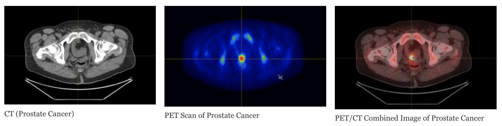
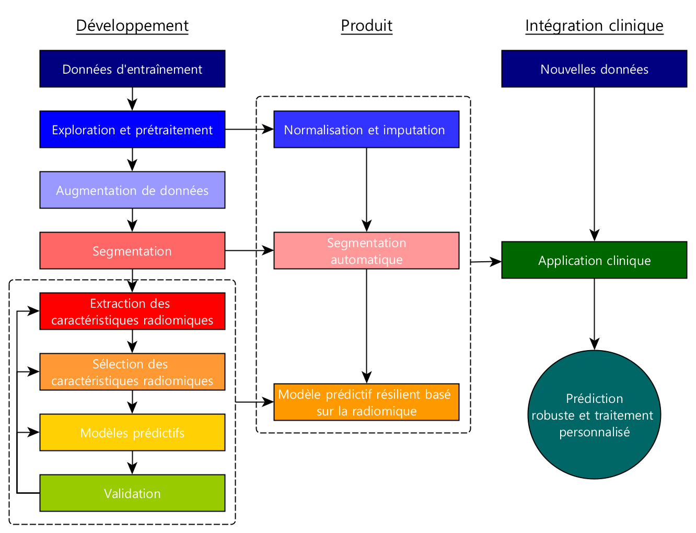
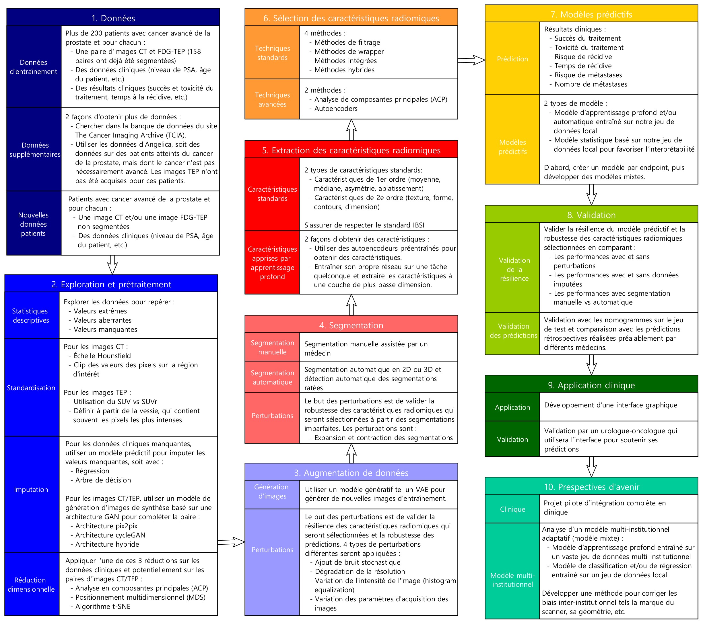

## Status

Completed (2021-2024)

## Type

Master's

## Team

- [Maxence Larose]()1,2,3(2021-aujourd'hui)
- [Louis Archambault](https://www.crchudequebec.ulaval.ca/recherche/chercheurs/louis-archambault/)1,2(2021-aujourd'hui)
- [Martin Vallières]()3(2021-aujourd'hui)

1 Physics, physics engineering and optics department, Université Laval, Québec (QC), Canada

2 CHU de Québec, Québec (QC), Canada

3 Computer science department, Université de Sherbrooke, Sherbrooke (QC), Canada

## Project goal

**Objective**: To develop resilient predictive models based on quantitative imaging and clinical features to guide 
treatment for advanced prostate cancer using images from different modalities such as computed tomography (CT) and 
positron emission tomography (PET).

**3 specific objectives:** 

- Generation of synthetic data to impute missing data.
- Automatic segmentation of organs of interest and detection of failed segmentations.
- Robust prediction of clinical outcomes based on stable radiomic features.
