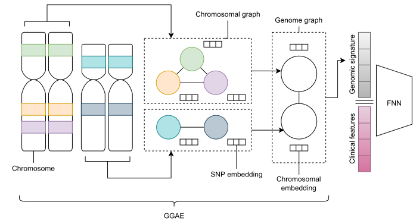

## Status

Completed  (2020-2022)

## Type

Master's

## Équipe

- [Nicolas Raymond]()1 (2020-today)
- [Hakima Laribi]()1 (2022-today)
- [Mehdi Mitiche]()1 (2020-2021)
- [Martin Vallières]()1 (2020-today)

1 Computer science department, Université de Sherbrooke, Sherbrooke (QC), Canada

## Description

Acute lymphoblastic leukemia (ALL) is the most frequently diagnosed cancer in children. 
Even though childhood ALL presents a high survival rate, approximately two thirds of survivors present 
one or more late adverse effects such as obesity, dyslipidemia, osteonecrosis and hypertension during 
adulthood. The current research project focus on the implementation of tools to help the diagnosis and 
the early prediction of particular late adverse effects.

The first phase is dedicated to the implementation of an ameliorated model to estimate the maximal 
oxygen consumption of childhood ALL survivors. This estimate can further be used for the diagnosis of 
cardiorespiratory health conditions.

The second phase focuses on the development of an early obesity prediction model that uses clinical 
variables from the end of childhood ALL treatment as well as genomic variables.

For each of the phases mentioned above, we compare the performance of graph neural networks to other 
common models, precisely the multilayer Perceptron, a linear regression, a random forest and a decision 
tree with gradient boosting (XGBoost). In particular, the second phases presents the performance of a 
new graph neural network architecture used to encode the genome of the patients. The latter, is presented 
in the figure below.

