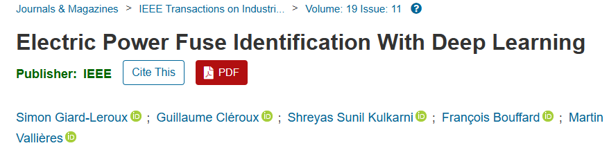

## Date

2023-02-16

## Authors
  
  - [Simon Giard-Leroux]()1,2
  - [Guillaume Cléroux]()1
  - [Shreyas Sunil Kulkarni]()3
  - [François Bouffard](https://www.mcgill.ca/ece/francois-bouffard)4
  - [Martin Vallières]()1

1 Department of Computer Science, Université de Sherbrooke, Sherbrooke, QC, Canada

2 PowerTree, Montréal, Qc, Canada.

3 Birla Institute of Technology and Science, Pilani, India.

4 Department of Electrical and Computer Engineering, McGill University, Montréal, Québec, Canada.

## Abstract

As part of arc flash studies, survey pictures of electrical installations need to be manually analyzed. A challenging task is to identify fuse types, which can be determined from physical characteristics, such as shape, color, and size. To automate this process using deep learning techniques, a new dataset of fuse pictures from past arc flash projects and data from the web was created. Multiple experiments were performed to train a final model, reaching an average precision of 91.06% on the holdout set, which confirms its potential for identification of fuse types in new photos. By identifying fuse types using physical characteristics only, the need to take clear pictures of the label text is eliminated, allowing pictures to be taken away from danger, thereby improving the safety of workers. All the resources needed to repeat the experiments are openly accessible, including the code and datasets.

## Links

  - [Paper in IEEE Transactions on Industrial Informatics](https://ieeexplore.ieee.org/abstract/document/10045819)
  - [Paper in PDF version](https://ieeexplore.ieee.org/stamp/stamp.jsp?tp=&arnumber=10045819)
