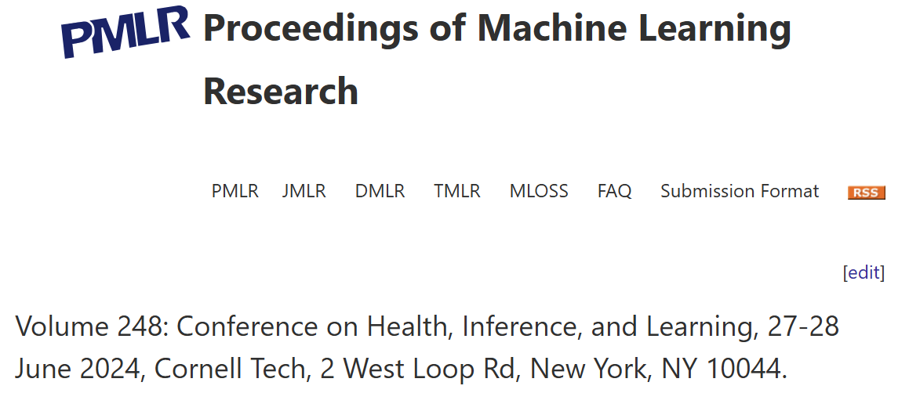

## Date

2024-06-27

## Authors

- [Nicolas Raymond]()1
- [Hakima Laribi]()1
- Maxime Caru2,3
- [Mehdi Mitiche]()1
- Valérie Marcil4
- Maja Krajinovic4
- Daniel Curnier4
- Daniel Sinnett4
- [Martin Vallières]()1,5

1 Department of Computer Science, Université de Sherbrooke, Sherbrooke (QC), Canada

2 Department of Pediatrics, Division of Hematology and Oncology, Pennsylvania State Health Children’s Hospital, Hershey (PA), USA

3 Department of Public Health Sciences, Penn State University College of Medicine, Hershey (PA), USA

4 Research Center, Sainte Justine University Health Center, Université de Montréal, Montreal (QC), Canada

5 Centre de recherche du Centre hospitalier universitaire de Sherbrooke, Sherbrooke (QC), Canada

## Abstract

Approximately two-thirds of survivors of childhood acute lymphoblastic leukemia (ALL) cancer develop late adverse effects post-treatment. Prior studies explored prediction models for personalized follow-up, but none integrated the usage of neural networks to date. In this work, we propose the Error Passing Network (EPN), a graph-based method that leverages relationships between samples to propagate residuals and adjust predictions of any machine learning model. We tested our approach to estimate patients’ \vo peak, a reliable indicator of their cardiac health. We used the EPN in conjunction with several baseline models and observed up to 12.16% improvement in the mean average percentage error compared to the last established equation predicting \vo peak in childhood ALL survivors. Along with this performance improvement, our final model is more efficient considering that it relies only on clinical variables that can be self-reported by patients, therefore removing the previous need of executing a resource-consuming physical test.

## Links

- [Paper in journal](https://proceedings.mlr.press/v248/raymond24a.html)
- [Paper in PDF version](https://raw.githubusercontent.com/mlresearch/v248/main/assets/raymond24a/raymond24a.pdf)
