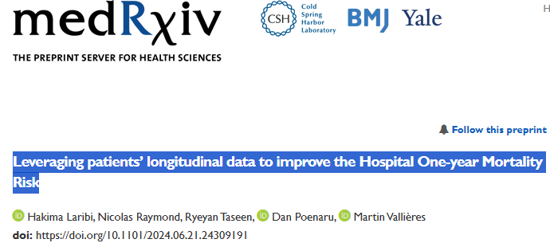

## Date

2024-07-26

## Authors

  - [Hakima Laribi]()1
  - [Nicolas Raymond]()1
  - Ryeyan Taseen2
  - Dan Poenaru3,4
  - [Martin Vallières]()1,5

1 Department of Computer Science, Université de Sherbrooke, Sherbrooke, QC, Canada

2 Department of Medicine, Cambridge Memorial Hospital, Cambridge, Canada.

3 Department of Pediatric Surgery, McGill University Health Centre, Montreal, Canada.

4 Centre for Outcomes Research and Evaluation (CORE), Research Institute of the McGill University Health Centre, Montreal, Canada.

5 Centre de recherche du Centre hospitalier universitaire de Sherbrooke, Sherbrooke, Canada.

## Abstract

  **Purpose**: Predicting medium-term survival after admission is necessary for identifying end-of-life
  patients who may benefit from goals of care (GOC) discussions. Considering that several patients
  have multiple hospital admissions, this study leverages patients’ longitudinal data and information
  collected routinely at admission to predict the Hospital One-year Mortality Risk.

  **Methods**: We propose an Ensemble Long Short-term Memory neural network (ELSTM) to predict
  one-year mortality using patients’ longitudinal records. The model was evaluated: (i) with only predictors reported upon admission (AdmDemo); and (ii) also with diagnoses available later during patients’
  stay (AdmDemoDx). Using records of 123,646 patients with 250,812 hospitalizations from 2011-2021,
  our dataset was split into a learning set (2011-2017) to compare models with and without longitudinal information using nested cross-validation, and a holdout set (2017-2021) to assess clinical utility
  towards GOC discussions.

  **Results**: The ELSTM achieved a significant increase in predictive performance using longitudinal
  information (p-value < 0.05) for both the AdmDemo and AdmDemoDx predictors. For randomly
  selected hospitalizations in the holdout set, the ELSTM showed: (i) AUROCs of 0.83 (AdmDemo)
  and 0.87 (AdmDemoDx); and (ii) superior decision-making properties, notably with an increase in
  precision from 0.25 for the standard process to 0.28 (AdmDemo) and 0.36 (AdmDemoDx). Feature
  importance analysis confirmed that the utility of the longitudinal information increases with the
  number of patient hospitalizations.

  **Conclusion**: Integrating patients’ longitudinal data provides better insights into the severity of illness
  and the overall patient condition, in particular when limited information is available during their stay.

## Links

  - [Paper in arXiv](https://www.medrxiv.org/content/10.1101/2024.06.21.24309191v3)
  - [Paper in PDF version](https://www.medrxiv.org/content/10.1101/2024.06.21.24309191v3.full.pdf)
