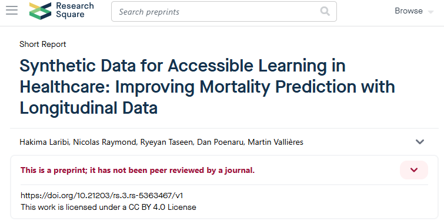

## Date

2024-11-04

## Authors

  - [Hakima Laribi]()1
  - [Nicolas Raymond]()1
  - Ryeyan Taseen2
  - Dan Poenaru3,4
  - [Martin Vallières]()1,5

1 Department of Computer Science, Université de Sherbrooke, Sherbrooke, QC, Canada

2 Department of Medicine, Cambridge Memorial Hospital, Cambridge, Canada.

3 Department of Pediatric Surgery, McGill University Health Centre, Montreal, Canada.

4 Centre for Outcomes Research and Evaluation (CORE), Research Institute of the McGill University Health Centre, Montreal, Canada.

5 Centre de recherche du Centre hospitalier universitaire de Sherbrooke, Sherbrooke, Canada.

## Abstract

Accurate prediction of medium-term survival after admission is necessary for identifying end-of-life patients who may benefit from earlier goals of care (GOC) discussions. While previous studies have leveraged admission data from electronic health records (EHRs) to predict the hospital one-year mortality risk (HOMR) score, they focused on single admissions, without considering longitudinal patient history and its impact on prognostication.  To address this gap, we developed the Ensemble Long Short-Term Memory (ELSTM) neural network, which learns from multiple visits of the same patient to improve the accuracy of the HOMR score. Furthermore, in this work, we generated a synthetic dataset and made it publicly available to encourage further research in this area while safeguarding patient privacy.

## Links

  - [Paper in Research Square](https://www.researchsquare.com/article/rs-5363467/v1)
  - [Paper in PDF version](https://www.researchsquare.com/article/rs-5363467/v1.pdf?c=1730707610000)
