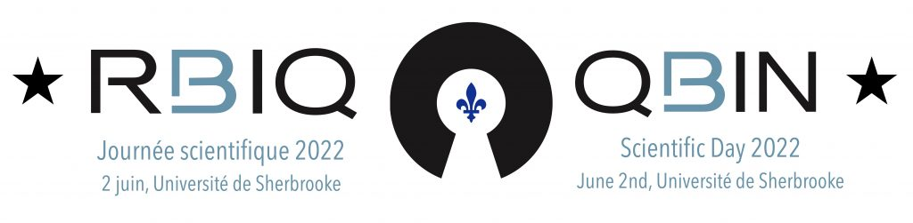

## Date

2022-06-02

## Authors

- [Mahdi Ait Lhaj Loutfi]()

## Summary 

Cancer is a heterogeneous disease with unique genomic and phenotypic characteristics that differ from patient to 
patient and even from tumor region to tumor region. Precision oncology is therefore an important field in cancer 
research as it allows for specific treatments for each cancer patient based on their genomic profile. This genomic 
heterogeneity of aggressive tumors translates into heterogeneous tumor characteristics at the anatomical scale that 
can be captured using quantitative image analysis. The latter will give an ability to make accurate tumor phenotypic 
predictions. The extraction of these features is known as "radiomic analysis" which is performed using several 
mathematical algorithms to extract these features. A platform under the name [MEDomics](https://www.medomics.ai/)Lab 
which is a result of an international collaboration (MEDomics Consortium) has been developed for the extraction of 
radiomic features from original or previously filtered images in order to highlight discriminating features in these 
medical images. The validation of these image analyses remains a major challenge. Therefore, an international 
collaboration under the name [IBSI](https://theibsi.github.io/) (Image Biomarker Standardization Initiative) seeks 
to standardize the extraction of these image features through the implementation of several standards and guidelines 
in order to establish a consensus between the different participating teams/universities. The standardization has 
been separated into two chapters, [IBSI 1](https://theibsi.github.io/ibsi1/) and 
[IBSI 2](https://theibsi.github.io/ibsi2/). IBSI 1 focuses on the standardization of radiomic feature calculations. 
On the other hand, IBSI 2, which is currently under development, targets the standardization of the implementation 
of convolutional filters (e.g., Gaussian Laplacian, wavelet-based filter) as well as the extraction of radiomic 
features from the previously filtered images. We have integrated the procedures established by IBSI into the 
[MEDomics](https://www.medomics.ai/)Lab platform. Our results show consensus with the majority of IBSI collaborators 
for both chapters. The MEDomicsLab tool will be made available free of charge to researchers in Quebec. It is 
expected that this tool for extracting rich and complex radiomic features will be used to conduct multicenter studies 
in precision oncology.

## Links

- [Event Details](https://event.fourwaves.com/fr/qbinscientificday2022/resumes/1277c5e9-e4bf-4739-9265-d21af534e94f)
- [Presentation PDF](https://cdn.fourwaves.com/static/media/formdata/985f0c64-8ac6-4c6f-a03c-146a28691c26/dd5a0f94-52a1-4c97-8ca9-20fd067fc568.pdf)
