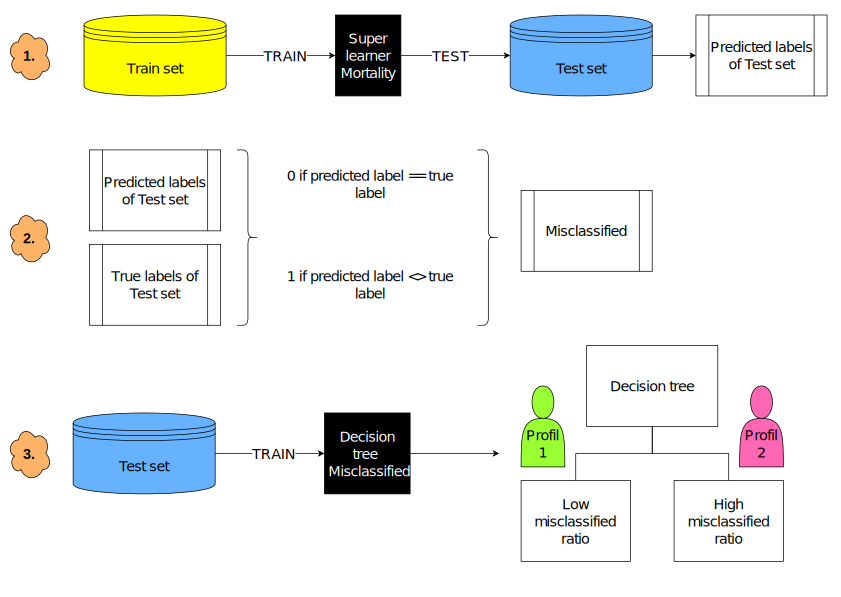

## État

En cours (2021-aujourd'hui)

## Type

Doctorat

## Équipe

- [Olivier Lefebvre]()1 (2021-aujourd'hui)
- [Félix Camirand Lemyre](https://www.usherbrooke.ca/mathematiques/nous-joindre/personnel/corps-professoral/professeurs/felix-camirand-lemyre)2 (2021-aujourd'hui)
- [Jean-François Éthier](https://www.usherbrooke.ca/recherche/specialistes/details/jean-francois.ethier)3 (2021-aujourd'hui)
- [Martin Vallières]()1 (2021-aujourd'hui)

1 Départment d'informatique, Université de Sherbrooke, Sherbrooke (QC), Canada

2 Départment de mathématiques, Université de Sherbrooke, Sherbrooke (QC), Canada

3 Département de médecine, Université de Sherbrooke, Sherbrooke (QC), Canada

## Description
  L’intelligence artificielle dans le domaine médical peut grandement contribuer à améliorer les soins de santé. L’apprentissage machine conventionnelle, dite centralisée, représente toutefois plusieurs limitations, principalement dues à la quantité limitée de données disponibles pour la recherche. Une option triviale serait de regrouper toutes les données de plusieurs centres médicaux en un seul centre (une seule base de données centralisée). Il est cependant difficile ou même impossible de centraliser ces informations en raison de la nature confidentielle des données médicales ainsi que des réglementations entourant ce domaine. Nous devons donc développer des modèles d’apprentissage machine dits distribués (Distributed Learning) avec des ensembles de données fédérés (répartis en divers nœuds, sémantiquement et structurellement comparables). Afin de garantir un niveau de confidentialité sur les données, nous devons de plus considérer des mesures de confidentialité dans nos modèles. Nous appliquons ainsi les concepts de la confidentialité différentielle (Differential Privacy). L’apprentissage distribué et la confidentialité différentielle engendrent généralement une certaine perte de performance pour les prédictions. Nous tenterons donc de diminuer ces pertes de performance avec un modèle ensembliste combinant plusieurs modèles d’apprentissage, et intitulé le « Super Apprenant ». De plus, nous développerons une méthode afin d’évaluer l’incertitude de notre modèle pour chaque prédiction faite. Nous pourrons ainsi éviter d’inférer un résultat lorsque le modèle démontrera une trop grande incertitude. Afin d’évaluer les gains de performance obtenus par ces méthodes, nous nous intéresserons à la prédiction de mortalité après admission à l’unité de Soins Intensifs. La prédiction de mortalité en Soins Intensifs est cruciale pour un bon traitement des patients. Le but du projet est donc de développer un Super Apprenant distribué avec confidentialité différentielle pour prédire la mortalité après admission aux Soins Intensifs.

  ## Objectifs
  - 1) Investigation de l’incertitude de prédiction de modèles
  - 2)  -Développement un modèle d’apprentissage ensembliste fédéré (super-apprenant distribué)
        -Ajout de confidentialité différentielle aux modèles d’apprentissage

