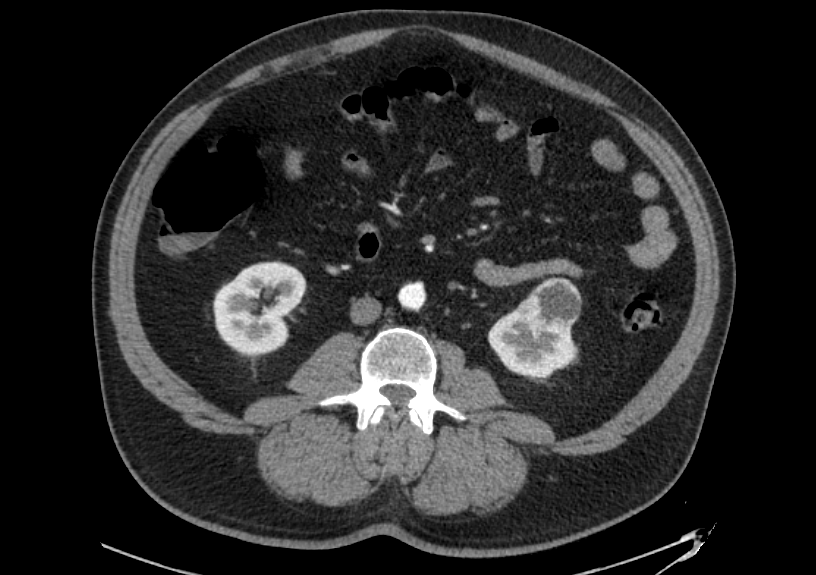

## État

En cours (2022-aujourd'hui)

## Type

Maîtrise

## Équipe

- [Teodora Boblea Podasca]()1 (2022-aujourd'hui)
- [Dr Patrick Richard](https://www.usherbrooke.ca/recherche/specialistes/details/patrick.richard)1 (2022-aujourd'hui)
- [Martin Vallières]()2 (2022-aujourd'hui)

1 Département de chirurgie, service d’urologie, Université de Sherbrooke, Sherbrooke (QC), Canada

2 Départment d'informatique, Université de Sherbrooke, Sherbrooke (QC), Canada

## Description

Malgré le progrès en imagerie médicale au cours des dernières décennies, celle-ci ne permet pas de déterminer avec 
précision si une petite masse rénale (< 4 cm) est bénigne ou maligne. Ceci complique le travail urologues quant au 
choix des patients qui pourraient bénéficier d’une approche conservatrice (surveillance active) plutôt que d’un 
traitement invasif. Présentement, les traitements disponibles sont : (1) la chirurgie et (2) la thermoablation. 
Malgré leur efficacité, ce sont des traitements invasifs qui pourraient être évités chez certains patients. 

L’objectif de ce projet est d’établir un modèle qui permettra de prédire avec fiabilité si une petite masse rénale 
est bénigne ou maligne. Afin d’atteindre cet objectif, nous combinerons la radiomique (sur les CT scan) et certaines 
données cliniques comme le sexe et l’âge.  

À terme, nous espérons que ce projet aidera les médecins à offrir un traitement plus adapté à chaque patient et 
permettra une meilleure utilisation des ressources.
