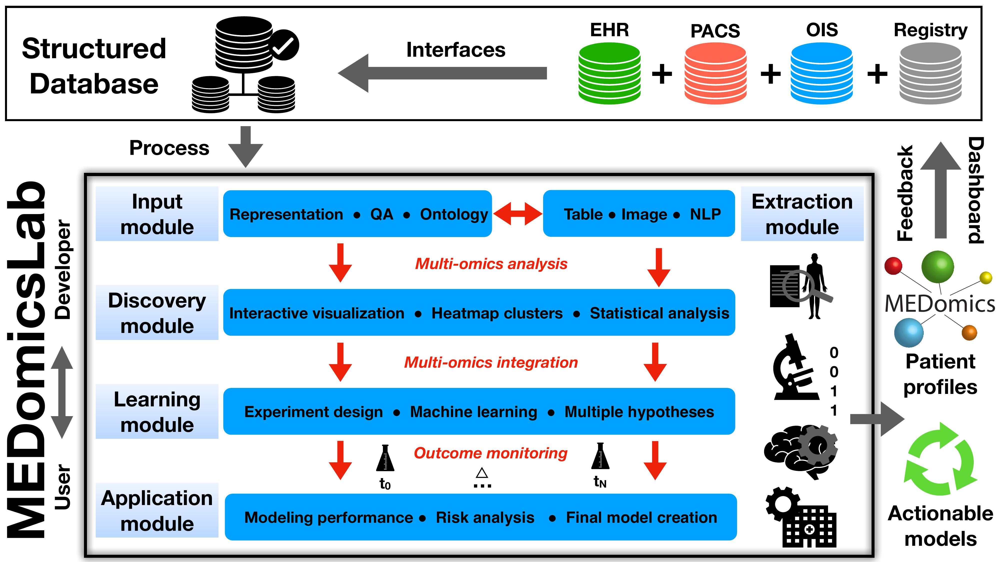

## État

En cours (2020-aujourd'hui)

## Type

Général

## Équipe

- [Andréanne Allaire]()1 (2022-2024)
- [Charles Lévesque-Matte]()1 (automne 2020)
- [Clarisse Cheng]()1 (été 2022)
- [Corentin Gauthier]()1 (été 2022)
- [Guillaume Blain]()1 (été 2022-aujourd'hui)
- [Hithem Lamri]()1 (automne 2022-aujourd'hui)
- [Jonathan Perron]()1 (2020-2021)
- [Kayla Davio-Roy]()1 (été 2021)
- [Mahdi Ait Lhaj Loutfi]()1 (2021-aujourd'hui)
- [Mamadou Mountagha Bah]()1 (2020-2021)
- [Mohammed Benabbassi]()1 (automne 2022-aujourd'hui)
- [Nicolas Longchamps]()1 (été 2022-aujourd'hui)
- [Robin Mailhot]()1 (automne 2020)
- [Martin Vallières]()1 (2020-aujourd'hui)

1 Département d'informatique, Université de Sherbrooke, Sherbrooke (QC), Canada

## Description

MEDomicsLab est une plateforme de calcul _open-source_ pour la modélisation intégrative des données en médecine. 
Elle a été créée par un consortium international de scientifiques médicaux (<https://medomics.ai>), dont l'objectif 
principal est de faciliter le développement et la traduction clinique des applications de l'intelligence artificielle 
(IA) en médecine. La plateforme est basée sur le langage de programmation Python et contient cinq modules majeurs qui 
permettent de charger, traiter, explorer des données multi-omiques, et de créer et évaluer des modèles exploitables 
pour la médecine de précision. Le flux de travail intrinsèque de MEDomicsLab est conçu pour fournir différents 
niveaux d'abstraction de la complexité méthodologique aux utilisateurs et aux développeurs via des scripts 
d'application, des paramètres d'option et des structures de classe. En général, MEDomicsLab est 
envisagé pour être au centre de équipes de recherche multidisciplinaires et des infrastructures de 
bases de données hospitalières.

Les récents progrès des technologies dites « omiques » (génomiques, radiomiques, protéomiques,
etc.) offrent des possibilités sans précédent pour caractériser les processus biologiques qui sont
reliés aux phénotypes des maladies. La combinaison efficace de ces éléments en tant que «
modélisation multi-omique » nous permettra certainement de mieux adapter les traitements à
chaque patient (c.-à-d. « médecine de précision »)

Étant donnée la complexité des problèmes médicaux, l'atteinte du plein potentiel de la médecine de
précision est directement reliée à notre capacité à bien gérer, structurer et tirer profit des bases de
données de nos hôpitaux. Dès lors, la maîtrise et la combinaison des techniques d'analyse de
données suivantes devraient augmenter l'impact des modèles de prédiction « multi-omiques »
qui sont construits à partir de ces bases de données:

1. _Analyse d'image_ : l'extraction des caractéristiques radiomiques nous permet de mieux caractériser l'hétérogénéité  tumorale. Le logiciel [MEDimage]() est la composante consacrée pour cette tâche.
2. _Apprentissage automatique_ : certaines techniques d'apprentissage permettent de mieux combiner les données de différentes catégories (telles que multi-omiques).
3. _Apprentissage profond_ : la multitude d'architectures de réseaux de neurones profonds offre plusieurs possibilités par rapport à l'apprentissage automatique de différentes tâches en médecine. La performance de certains réseaux est parfois supérieure à celle des humains.
4. _Traitement automatique du texte_ : le traitement et le codage automatique des comptes rendus textuels des dossiers électroniques des patients permettraient une meilleure intégration d'informations pertinentes à la modélisation multi-omique durant toute la période de prise en charge des patients.
5. _Apprentissage fédéré_ : afin d'augmenter la quantité de données modélisées provenant de différents établissements de santé, une approche d'apprentissage distribué peut être utilisée - les données sont conservées dans les limites de chaque établissement, évitant ainsi les problèmes de transfert de données et de confidentialité.

Cette plateforme est développée en collaboration avec : 

- [University California San Francisco](https://www.ucsf.edu/) (Olivier Morin, Taman Upadhaya, Jorge Barrios)
- [University of Toronto](https://www.utoronto.ca/) (Jan Seuntjens)
- [The D-Lab](https://precisionmedicinemaastricht.eu/the-d-lab/) (Philippe Lambin, Henry Woodruff, Avishek Chatterjee)
- [Oncoray](https://www.oncoray.de/) (Alex Zwanenburg, Steffen Löck)
- [Université Laval](https://www.ulaval.ca/) (Louis Archambault, Philippe Després) 
