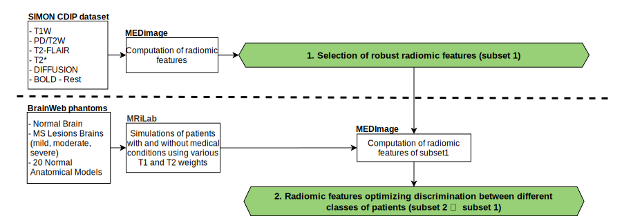

## État

En cours (2021-aujourd'hui)

## Type

Maîtrise

## Équipe

- [Andréanne Allaire]()1 (2021-aujourd'hui)
- [Philippe Després](https://iid.ulaval.ca/equipes/philippe-despres/)2 (2021-aujourd'hui)
- [Martin Vallières]()1 (2021-aujourd'hui)

1 Départment d'informatique, Université de Sherbrooke, Sherbrooke (QC), Canada

2 Département de physique, de génie physique et d'optique, Université Laval, Québec (QC), Canada

## Description

En imagerie médicale, les caractéristiques radiomiques permettent de caractériser l'hétérogénéité d'une région 
d'intérêt au niveau anatomique. Cette façon de quantifier l'hétérogénéité d'une région d'intérêt peut être utile, 
par exemple, afin d'identifier les tumeurs les plus agressives en oncologie. Pour ce faire, nous posons ici 
l'hypothèse que la variation des séquences d'acquisition d'imagerie par résonance magnétique (IRM) et ses 
différents niveaux de contraste qui en découlent permettrait d'optimiser l'analyse radiomique subséquente. 

Dans ce projet, un pipeline d'analyse d'images médicales réelles sera d'abord mis en place afin de quantifier 
la robustesse des caractéristiques radiomiques en fonction des variations des protocoles d'acquisition. Ensuite, 
un pipeline de simulation d'acquisition IRM sera développé afin d'évaluer le potentiel d'optimisation des 
caractéristiques radiomiques en médecine.
