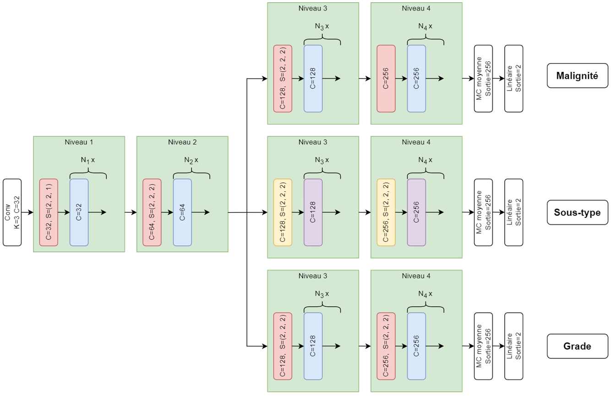

## État

En cours (2020-aujourd'hui)

## Type

Maîtrise

## Équipe

- [Alexandre Ayotte]()1 (2020-aujourd'hui)
- [Martin Vallières]()1 (2020-aujourd'hui)

1 Départment d'informatique, Université de Sherbrooke, Sherbrooke (QC), Canada

## Données

Pour ce projet, des données de 1 082 patients provenant de 5 institutions comportant des données cliniques telles
que l'âge, le sexe et la taille de la tumeur, ainsi que des images d'IRM 3D (T1, T2) avec la région d'intérêt des
tumeurs sont utilisées.

## Classification

À partir des données énoncées précédemment, l'objectif est de développer un modèle multi-tâches permettant d'effectuer
trois tâches de classification binaire, soient : 
- Classification de la malignité (399 bénignes, 683 malignes)
- Classification du sous-type (seulement pour les tumeurs malignes) (158 papillaire, 441 cellules claires)
- Classification du grade (seulement pour les tumeurs malignes) (391 grade faible, 202 grade élevé)

## Objectifs

- Développer un système de support à la décision intégré pour les trois tâches de classification
- Évaluer l'efficacité de l'apprentissage multi-tâches dans le contexte de l'imagerie médicale et de la classification de tumeurs
- Établir le bénéfice des radiomiques comme tâches auxiliaires dans le contexte de l'apprentissage multi-tâches
