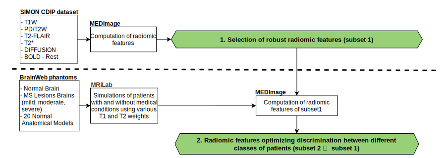

## État

Projet disponible

## Type

Maîtrise

## Description

En imagerie médicale, les caractéristiques radiomiques permettent l'obtention de mesures supplémentaires à celles cliniques et génomiques pour une région d'intérêt d'une image médicale. Ces radiomiques peuvent être utilisées dans l'aide à la décision dans un contexte de médecine de précision. La motivation de ce projet est que la détermination des radiomiques fiables ayant le meilleur potentiel prédictif permettrait d'améliorer la médecine de précision basée sur l'analyse d'images IRM. Pour ce faire, deux hypothèses sont posées à la base de ce projet. La première étant que l'étude des radiomiques d'images IRM intercentres avec un protocole unique pour un même patient permettrait de déterminer un sous-groupe de radiomiques robustes. La seconde est que le calcul des radiomiques robustes pour des images simulées de patients avec et sans condition médicale en utilisant divers poids T1 et T2 permettrait de déterminer un sous-groupe de radiomiques qui pourrait être utilisé afin d'optimiser la discrimination entre les différentes classes de patients (avec et sans condition médicale).

Pour vérifier ces hypothèses dans le but de déterminer un sous-groupe de radiomiques fiables ayant la meilleure capacité prédictive, un plan de la méthodologie du projet a été élaboré (voir la figure plus haut). Ce plan est subdivisé en deux parties distinctes. D'abord, un pipeline d'analyse d'images médicales réelles sera mis en place afin de quantifier la robustesse des caractéristiques radiomiques. Les images utilisées seront celles de la base de données SIMON ([Single Individual volunteer for Multiple Observation across Networks](http://fcon_1000.projects.nitrc.org/indi/retro/SIMON.html)). Ensuite, un pipeline de simulation d'acquisition IRM sera développé afin d'évaluer le potentiel d'optimisation des caractéristiques radiomiques en imagerie par résonance magnétique. Les fantômes utilisés pour les simulations seront ceux de [BrainWeb](https://brainweb.bic.mni.mcgill.ca/); le simulateur utilisé est celui de [MRiLab](https://doi.org/10.1109/TMI.2016.2620961). Les calculs des radiomiques effectués au cours du projet  seront faits à l'aide de la plateforme [MEDimage](https://github.com/MahdiAll99/MEDimage).
