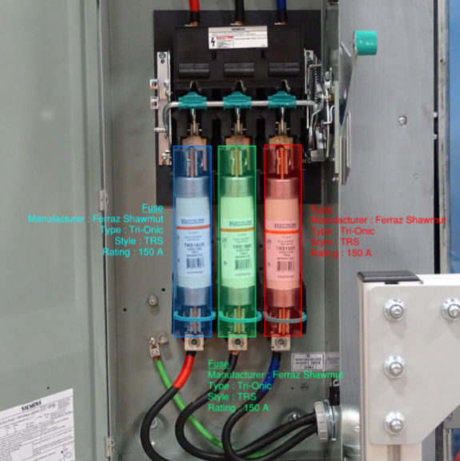

## État

Terminé (2020-2022)

## Type

Maîtrise

## Équipe

- [Simon Giard-Leroux]()1 (2020-2022)
- [Guillaume Cléroux]()1 (été 2021 et hiver 2022)
- [Alex Chorel-Campanozzi]()1 (été 2021)
- [Achille Lanctôt-Saumure]()1 (automne 2021)
- [Shreyas Sunil Kulkarni]()2 (2020-2021)
- [François Bouffard](https://www.mcgill.ca/ece/francois-bouffard)3 (2020-2022)
- [Martin Vallières]()1 (2020-2022)

1 Départment d'informatique, Université de Sherbrooke, Sherbrooke (QC), Canada

2 Birla Institute of Technology and Science, Pilani, Inde

3 Département de génie électrique et informatique, Université McGill, Montréal (QC), Canada

## Note

Ce projet n'est pas relié au domaine de l'informatique médicale, mais il implique des principes de détection 
d'objets qui seront appliqués à l'imagerie médicale dans le futur.

## Objectif

L’ingénierie électrique classique repose toujours sur des méthodes de travail basées sur l'analyse manuelle de 
photos et de plans, qui peuvent être lentes et sujettes à l’erreur humaine. Nous souhaitons appliquer les 
nouvelles technologies d'intelligence artificielle (IA) et d'apprentissage machine au domaine de l’ingénierie 
électrique classique afin de faciliter l'interprétation des plans et des photos d'équipements électriques. 
Par la suite, l'interprétation de ces informations permettrait de construire des modèles de calcul pour accélérer 
le travail manuel requis lors de la réalisation des études de court-circuit et d'arc électrique, tout en 
réduisant le risque d'erreur humaine.

Le premier objectif de ce projet sera de détecter le type de fusibles électriques sur des photos prises par des 
ingénieurs électriques lors de relevés de site dans des lieux tels que des bâtiments industriels. À cet effet, 
des photos de fusibles électriques collectées lors de précédents projets réalisés par la firme d’ingénierie CIMA+
et des photos provenant du Web (Google Images) seront utilisées pour former des algorithmes de détection d'objets. 
Le deuxième objectif de ce projet sera de détecter les symboles des équipements sur les plans électriques, détecter 
le texte descriptif lié à chaque symbole, détecter les liens entre les symboles et automatiser la création de 
modèles qui peuvent être importés dans un logiciel de calcul.

Cette automatisation apportera une plus grande précision et réduira le temps nécessaire pour interpréter les relevés 
des installations électriques, augmentant ainsi l’efficacité du travail de l’ingénieur électrique et la sécurité 
du public concernant les installations électriques.
