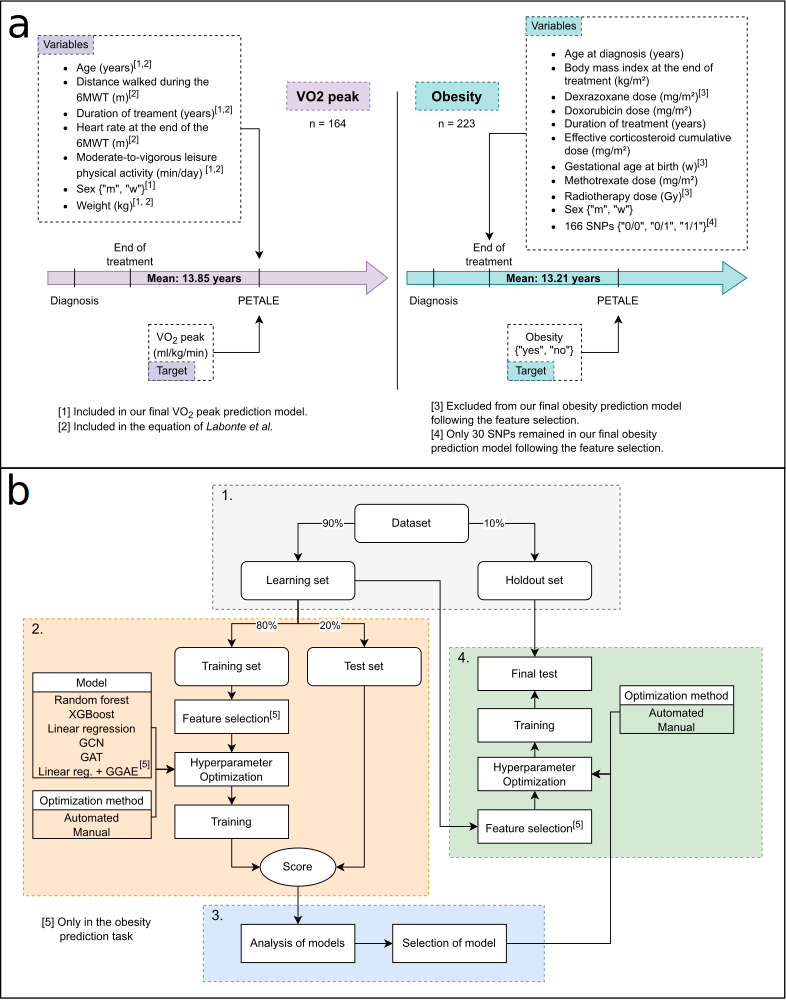
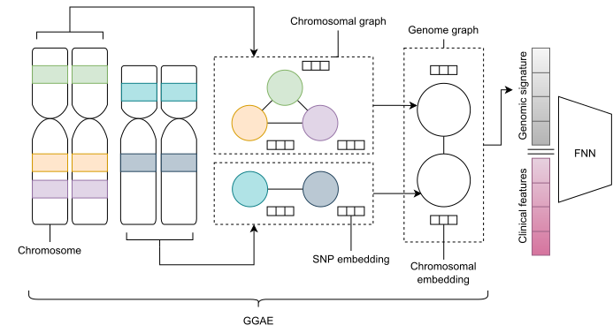

## État

Terminé (2020-2022)

## Type

Maîtrise

## Équipe

- [Nicolas Raymond]()1 (2020-aujourd'hui)
- [Hakima Laribi]()1 (2022-aujourd'hui)
- [Mehdi Mitiche]()1 (2020-2021)
- [Martin Vallières]()1 (2020-aujourd'hui)

1 Départment d'informatique, Université de Sherbrooke, Sherbrooke (QC), Canada

## Description

La leucémie aiguë lymphoblastique (LAL) est le cancer le plus fréquemment diagnostiqué chez les enfants. 
Bien que la majorité des personnes atteintes de la LAL infantile survivent, environ deux-tiers d'entre 
elles développent un ou plusieurs problèmes de santé tels que l'obésité, la dyslipidémie, l'ostéonécrose 
et l'hypertension lors de l'âge adulte. Le présent projet de recherche s'intéresse aux développements 
d'outils pour l'aide au diagnostic, ainsi que l'aide à la prédiction hâtive, de certaines de ces 
conditions de santé.

La phase 1 consiste au développement d'un modèle d'estimation amélioré de la consommation maximal 
d'oxygène pour le diagnostic de problèmes cardiorespiratoires.

La phase 2 consiste au développement d'un modèle de prédiction de l'obésité se basant sur des variables 
disponibles depuis la fin du traitement de la LAL, en particulier, des composantes du génomes.

Pour chacune des phases mentionnées ci-dessus, nous comparons la performance de réseaux de neurones
graphiques avec celles de d'autres modèles communs, soit le Perceptron multi-couches, la régression 
linéaire, la forêt aléatoire et l'arbre de décision avec boosting de gradient (XGBoost). 
En particulier, la seconde phase présente également la performance d'une nouvelle architecture graphique
pour encodeur le génome des patients. Celle-ci est présentée dans la figure ci-dessous.

