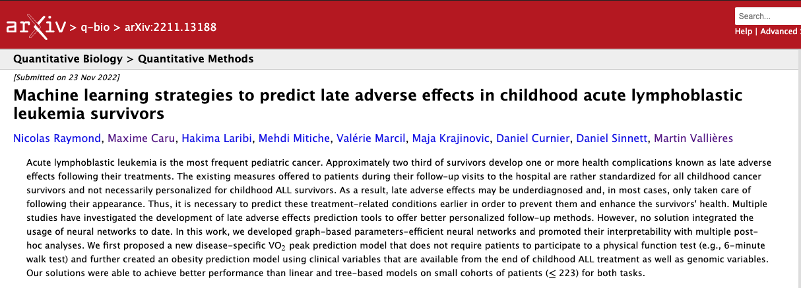

## Date

2022-11-30

## Auteurs

  - [Nicolas Raymond]()1
  - Maxime Caru2,3
  - [Hakima Laribi]()1
  - [Mehdi Mitiche]()1
  - Valérie Marcil4
  - Maja Krajinovic5
  - Daniel Curnier6
  - Daniel Sinnett4
  - [Martin Vallières]()1

1 Département d'Informatique, Université de Sherbrooke, Sherbrooke, Canada

2 Division of Hematology and Oncology, Department of Pediatrics, Penn State College of Medicine, Hershey, PA, USA

3 Department of Public Health Sciences, Penn State College of Medicine, Hershey, PA, USA

4 Centre de Recherche, Centre Hospitalier Universitaire Sainte-Justine, Département de nutrition, Université de Montréal, Montréal, Canada

5 Centre de Recherche, Centre Hospitalier Universitaire Sainte-Justine, Département de Pédiatrie, Université de Montréal, Montréal, Canada

6 Centre de Recherche, Centre Hospitalier Universitaire Sainte-Justine, École de Kinésiologie et des Sciences de l'Activité Physique, Faculté de Médecine, Université de Montréal, Montréal, Canada

## Résumé

  Acute lymphoblastic leukemia is the most frequent pediatric cancer. Approximately two third of survivors develop one 
  or more health complications known as late adverse effects following their treatments. The existing measures offered 
  to patients during their follow-up visits to the hospital are rather standardized for all childhood cancer survivors 
  and not necessarily personalized for childhood ALL survivors. As a result, late adverse effects may be underdiagnosed
  and, in most cases, only taken care of following their appearance. Thus, it is necessary to predict these 
  treatment-related conditions earlier in order to prevent them and enhance the survivors’ health. Multiple studies have
  investigated the development of late adverse effects prediction tools to offer better personalized follow-up methods. 
  However, no solution integrated the usage of neural networks to date. In this work, we developed graph-based 
  parameters-efficient neural networks and promoted their interpretability with multiple post-hoc analyses. 
  We first proposed a new disease-specific VO2 peak prediction model that does not require patients to 
  participate to a physical function test (e.g., 6-minute walk test) and further created an obesity prediction model 
  using clinical variables that are available from the end of childhood ALL treatment as well as genomic variables. 
  Our solutions were able to achieve better performance than linear and tree-based models on small cohorts of patients 
  (&#8804; 223) for both tasks.

## Liens

  - [Page de l'article](https://arxiv.org/abs/2211.13188)
  - [Article en version PDF](https://arxiv.org/pdf/2211.13188.pdf)
