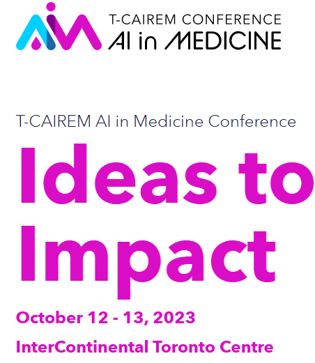

## Date

2023-10-13

## Auteurs

- [Olivier Lefebvre]()
- [Martin Vallières]()

## Résumé

 **Introduction**

 Machine learning models are powerful tools for clinical applications, like mortality prediction. However, they may exhibit 
different levels of performance, including some very poor one, for different patient groups with different profiles of 
attributes, despite strong global performance in external test sets. Secondly, ensuring model reliability and consistency 
over time is of utmost importance. Hence, our study seeks to develop a method to assess predictive uncertainty of 
classification models for individual patients and profiles at implementation and over time. 

  **Methods**

 We first develop an error variable indicating model mispredictions, then train a second-layer model called conditional 
accuracy (CA) to characterize mispredictions for individual patients and groups. This enables us to identify patient profiles 
with higher prediction errors (with lower CA) from the first model, as well as profiles undergoing behavior change. 

  **Results**

 Our approach helps determine if uncertainties compromise model usability for patients. Using a Random Forest model 
trained on 2011-2016 admissions (n=122,860) for 1-year mortality prediction from hospitalization data, we observed 
significant changes in model uncertainty for different patient profiles between 2017-2018 (n=22,034) and 2020-2021 
(n=27,664) cohorts. In particular, younger patients (<57yo) not admitted to medicine/surgery and with peripheral oedema 
had an accuracy drop from 86% to 38%, conditional accuracy from 0.69 to 0.39, and mortality rates surged from 10.8% to 
61.8%. This could represent higher mortality than previously for younger hospitalized COVID patients during that time 
period. 
  
  **Discussion/Conclusion**

  This study emphasizes exploring model failures and uncertainties in clinical deployments. The two-layer approach identifies 
patients with reduced model reliability and evaluates variability across patient profiles over time, considering profile 
behavior changes. Automatically identifying these uncertainties empowers responsible utilization of machine learning 
models in healthcare applications, providing improved support to users. Continued research in this direction is crucial for 
ensuring the safe and effective integration of machine learning models in clinical practice.

## Présentation


<embed src="/media/presentations/2023-tcairem-lefebvre.pdf" width="100%" height="600px" type="application/pdf">

## Liens

- [Détails sur l'événement](https://tcairem-conference.ca/)
- [Site web de T-CAIREM](https://tcairem.utoronto.ca/)
