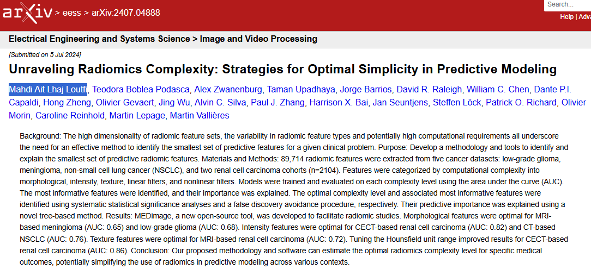

## Date

2024-07-05

## Auteurs

  - [Mahdi Ait Lhaj Loutfi]()1
  - [Teodora Boblea Podasca]()2
  - Alex Zwanenburg3,4,5,6
  - Taman Upadhaya7
  - Jorge Barrios8
  -David R. Raleigh9
  - William C. Chen8
  - Dante P.I. Capaldi8
  - Hong Zheng10
  - Olivier Gevaert11
  - Jing Wu12
  - Alvin C. Silva13
  - Paul J. Zhang14
  - Harrison X. Bai15
  - Jan Seuntjens16
  - Steffen Löck3
  - Patrick O. Richard17
  - Olivier Morin8
  - Caroline Reinhold18
  - Martin Lepage19,20
  - [Martin Vallières]()1,21

1 Department of Computer Science, Université de Sherbrooke, Sherbrooke, QC, Canada

2 Department of Surgery, Service of Urology, Université de Sherbrooke, Sherbrooke, QC, Canada

3 OncoRay – National Center for Radiation Research in Oncology, Faculty of Medicine and University Hospital Carl Gustav Carus, TUD Dresden University of Technology, Helmholtz-Zentrum Dresden-Rossendorf, Dresden, Germany

4 National Center for Tumor Diseases Dresden (NCT/UCC), Germany: German Cancer Research Center (DKFZ), Heidelberg, Germany

5 Faculty of Medicine and University Hospital Carl Gustav Carus, TUD Dresden University of Technology, Dresden, Germany

6 Helmholtz-Zentrum Dresden-Rossendorf (HZDR), Dresden, Germany

7 Department of Radiation Oncology, Cedars-Sinai Medical Center, Los Angeles, CA, USA

8 Department of Radiation Oncology, University of California San Francisco, San Francisco, CA, USA

9 Departments of Radiation Oncology, Neurological Surgery, and Pathology, University of California San Francisco, San Francisco, CA, USA

10 Center for Biomedical Informatics Research, School of Medicine, Stanford University, CA 94305, USA

11 Department of Medicine, and Department of Biomedical Data Science, Stanford University, Stanford, CA 94305, USA

12 Department of Radiology, The Second Xiangya Hospital of Central South University, Changsha, 410011, Hunan, China

13 Department of Radiology, Mayo Clinic Arizona, 13400 E Shea Blvd., Scottsdale, AZ 85259, USA

14 Department of Pathology and Clinical Medicine, Hospital of the University of Pennsylvania, Philadelphia, PA, USA

15 Department of Radiology and Radiological Sciences, Johns Hopkins, Baltimore, MD, USA

16 Princess Margaret Cancer Centre, University Health Network & Departments of Radiation Oncology & Medical Biophysics, University of Toronto, Toronto, ON, Canada.

17 Division of Urology, Centre Hospitalier Universitaire de Sherbrooke; Université de Sherbrooke Cancer Research Institute, Sherbrooke, QC, Canada

18 Department of Radiology, McGill University Health Center, Director and Co-founder, Augmented Intelligence Precision Health Laboratory (AIPHL) of the Research Institute of the McGill University Health Center, Montreal, QC, Canada

19 Département de médecine nucléaire et radiobiologie, Université de Sherbrooke, Sherbrooke, QC, Canada

20 Centre d’imagerie moléculaire de Sherbrooke, Université de Sherbrooke, Sherbrooke, QC, Canada

21 Centre de recherche du Centre hospitalier universitaire de Sherbrooke, Université de Sherbrooke, Sherbrooke, QC, Canada

## Résumé

  Background: The high dimensionality of radiomic feature sets, the variability in radiomic feature types and potentially high computational requirements all underscore the need for an effective method to identify the smallest set of predictive features for a given clinical problem. Purpose: To establish a methodology and provide tools for identifying and explaining the smallest set of predictive features radiomic features. Materials and Methods: Radiomic features (a total of 89,714) were extracted from five distinct datasets with different cancer types: low-grade glioma, meningioma, non-small cell lung cancer (NSCLC), and two renal cell carcinoma cohorts (n=2104). These features were categorized into complexity levels, defined by the number of computational steps required for their computation, encompassing morphological, intensity, texture, linear filters-based, and nonlinear filter-based features. For every dataset, models were trained on each complexity level specifically to classify clinical outcomes, and their performance was evaluated using the area under the curve (AUC). The most informative features were identified and their importance was explained. The optimal complexity level and associated most informative features were identified using systematic statistical significance analyses and a false discovery avoidance procedure, respectively. Their predictive importance was explained using a novel tree-based method. Results: MEDimage, a new open-source tool, was designed and implemented to streamline radiomic studies through both code-based and graphical-based approaches, and was applied using our proposed methodology to analyze the datasets. Morphological features were found to be optimal in two cases: for MRI-based meningioma (AUC: 0.65; sensitivity: 64%; specificity: 62%; 95% CI: 0.59, 0.72) and MRI-based low-grade glioma (AUC: 0.68; sensitivity: 68%; specificity: 69%; 95% CI: 0.60, 0.75). Additionally, intensity features were optimal in two instances: for contrast-enhanced CT (CECT)- based renal cell carcinoma (AUC: 0.82; sensitivity: 77%; specificity: 78%; 95% CI: 0.76, 0.88) and CT-based NSCLC (AUC: 0.76; sensitivity: 73%; specificity: 71%; 95% CI: 0.71, 0.80). Texture features were identified as optimal for MRI-based renal cell carcinoma (AUC: 0.72; sensitivity: 71%; specificity: 65%; 95% CI: 0.68, 0.77). Notably, in CECT-based renal cell carcinoma, the tuning of the Hounsfield unit range, which directly affects intensity-based features, led to improved results (AUC: 0.86). Conclusion: Our proposed methodology and software can estimate the optimal radiomics complexity level for specific medical outcomes, potentially simplifying the use of radiomics in predictive modeling across various contexts.

## Liens

  - [Page de l'article](https://arxiv.org/abs/2407.04888)
  - [Article en version PDF](https://arxiv.org/pdf/2407.04888)
