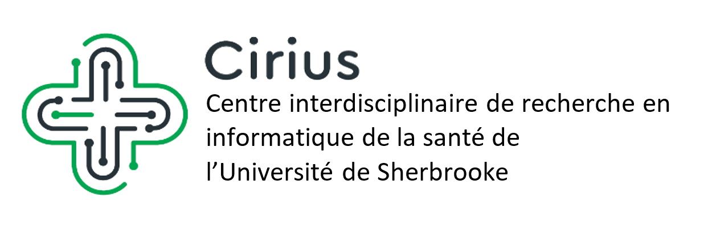

## Date

2022-10-20

## Auteurs

- [Olivier Lefebvre]()

## Résumé

  L’apprentissage automatique est de plus en plus utilisé dans diverses applications. 
  Les modèles d’apprentissage automatique peuvent entre autres être utilisés comme outils d’aide à 
  la décision dans des contextes critiques, comme le domaine médical. Il est toutefois souvent 
  compliqué d’expliquer les résultats obtenus par un modèle de prédiction. Il est donc important 
  que les modèles soient interprétables pour bien comprendre les décisions prises par le modèle et 
  de bien encadrer les utilisateurs. En ce sens, il existe diverses méthodes pour ajouter de 
  l’interprétabilité aux modèles, comme la méthode SHAP [S. Lundberg, 2017] qui estime l’impact de 
  chaque attribut sur la prédiction du modèle. Or, pour ce qui est des performances d’un modèle, la 
  méthode classique consiste à simplement appliquer ledit modèle sur un ensemble de tests, puis calculer 
  des métriques globales telles que la justesse ou encore l’aire sous la courbe ROC. Ces mesures 
  n’expliquent toutefois pas comment le modèle performera pour chaque patient individuellement. 
  En effet, certains sous-groupes de patients peuvent être moins bien représentés par un modèle, 
  or les performances globales ne permettent pas de le détecter. Par exemple, un modèle de prédiction 
  de mortalité entraîné principalement avec des données médicales de patients âgés risque de moins 
  bien performer pour des patients plus jeunes. Nous proposons donc le concept de performances 
  conditionnelles aux patients. Un modèle de prédiction prédirait ainsi un résultat pour un patient 
  (par exemple, survit ou décès), ainsi qu’une probabilité que la prédiction fournie soit erronée. 
  Les utilisateurs seraient donc mieux outillés pour détecter lorsque le modèle est potentiellement 
  aberrant et ainsi en faire une meilleure utilisation. Cette approche nous permettrait de plus 
  d’identifier des sous-groupes de patients pour lesquels notre modèle performe moins bien, et 
  donc potentiellement ne pas utiliser le modèle pour ces patients.

## Affiche
  

## Liens

- [Détails sur l'événement](https://www.dropbox.com/s/qshut4vilvaja93/Programmation_Cirius_JS_2022.pdf?dl=0)
- [Site web du CIRIUS](https://cirius.ca/)
