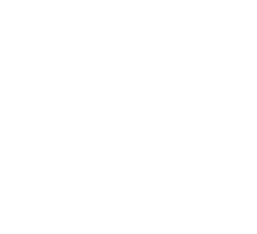

## Date

2022-04-22

## Auteurs

- [Maxence Larose]()1,2,3
- Nawar Touma2
- [Nicolas Raymond]()3
- Danahé LeBlanc1,2
- Fatemeh Rasekh2
- Bertrand Neveu2
- Hélène Hovington2
- [Martin Vallières]()3
- Frédéric Pouliot2
- Louis Archambault1,2

1 Département de physique, génie physique et optique, Université Laval, Québec (QC), Canada

2 CHU de Québec, Québec (QC), Canada

3 Départment d'informatique, Université de Sherbrooke, Sherbrooke (QC), Canada

## Résumé

This work proposes the use of a graph attention network (GAT) model combining radiomics and clinical data to 
improve the performance and interpretability of lymph node invasion (LNI) prediction in high-grade prostate 
cancer (PCa). Experiments were conducted using an in-house dataset of 170 high-grade PCa (Gleason ≥ 8), each 
with FDG-PET/CT images acquired prior to prostatectomy. To ensure interpretable connections between patients, 
the graph structure was constructed by merging the most important radiomic shape-based CT feature and first-order 
intensity-based PET feature to the clinically relevant features. The performance of the GAT model was compared to 
random forest (RF) and support vector machine (SVM) classifiers. On the 30 patients test set, the models reached 
\{AUC=0.765, bACC= 0.705\}, \{AUC=0.748, bACC=0.66\} and \{AUC=0.725,bACC=0.725\} for the GAT, RF and SVM models 
respectively. Even though SVM achieved higher balanced accuracy than GAT, the predictions made by the latter are 
more interpretable through the graph structure and attention mechanism.

## Liens

- [Page de l'article](https://openreview.net/forum?id=zIpx-MISaIA)
- [Article en version PDF](https://openreview.net/pdf?id=zIpx-MISaIA)
